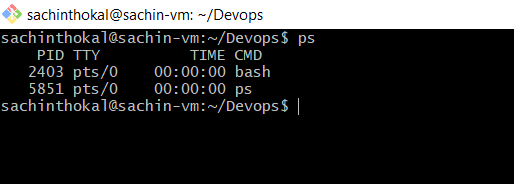
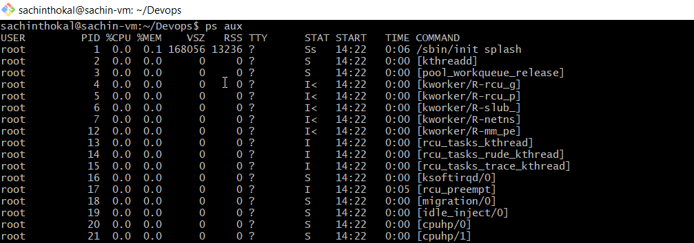
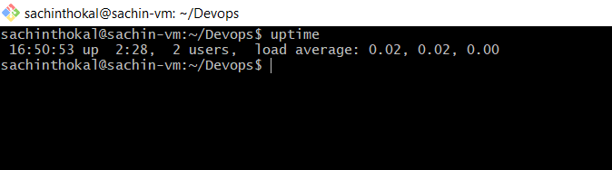
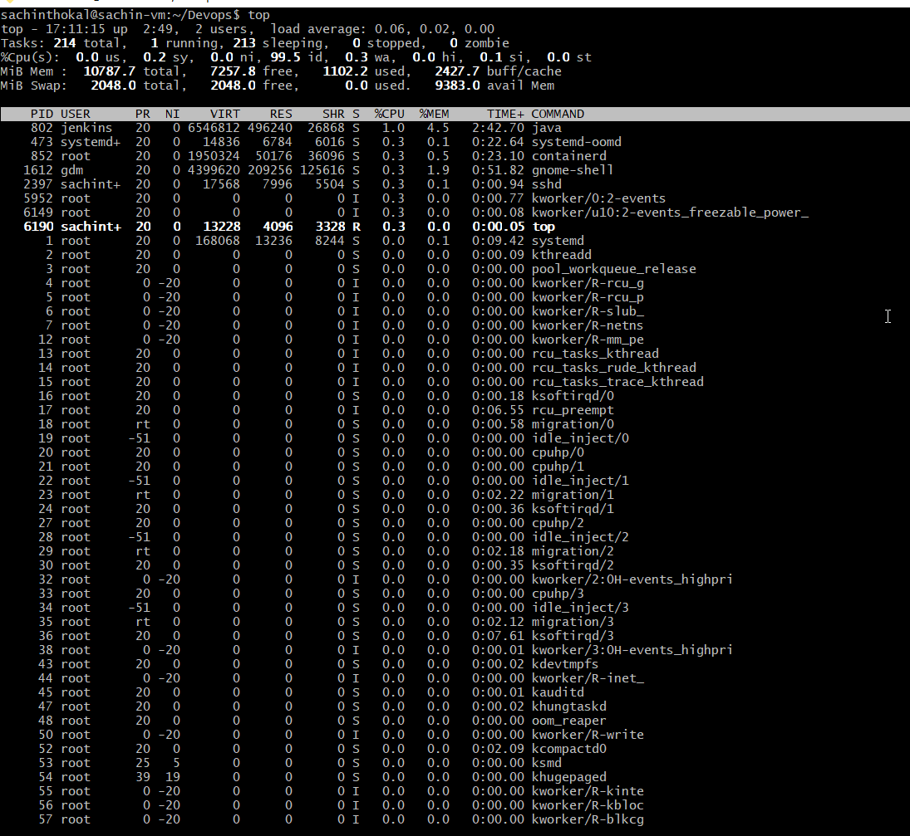
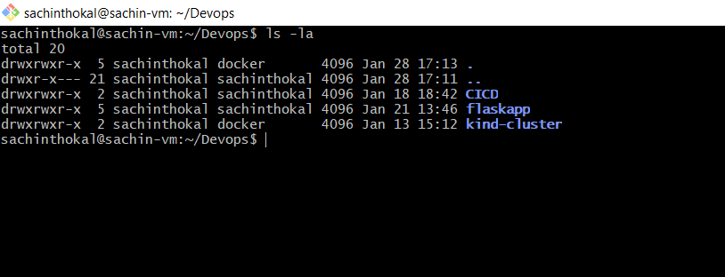
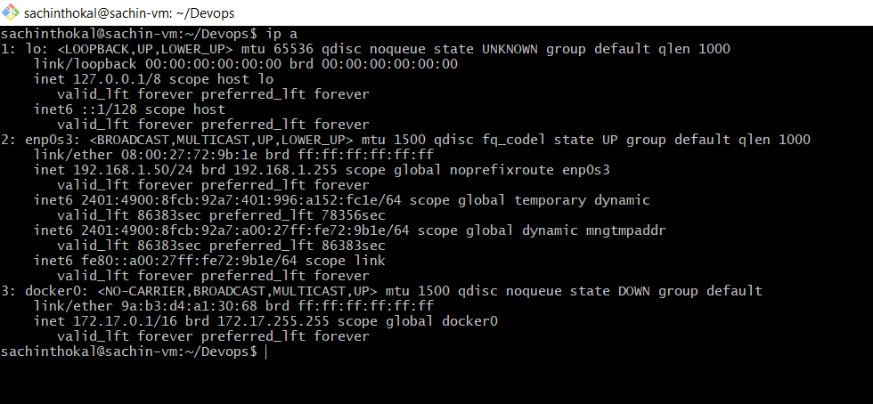
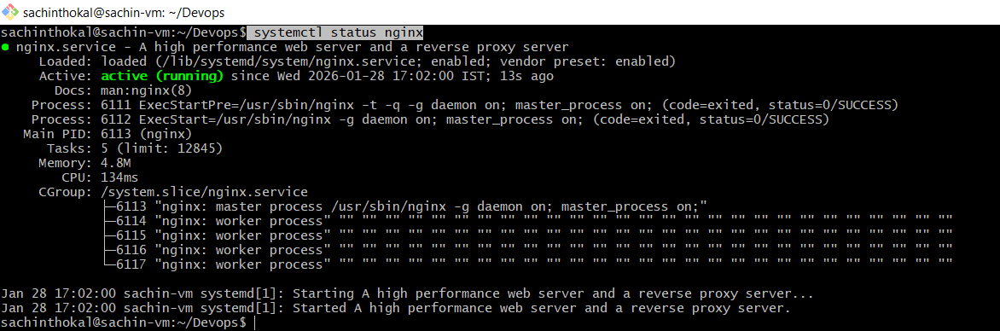
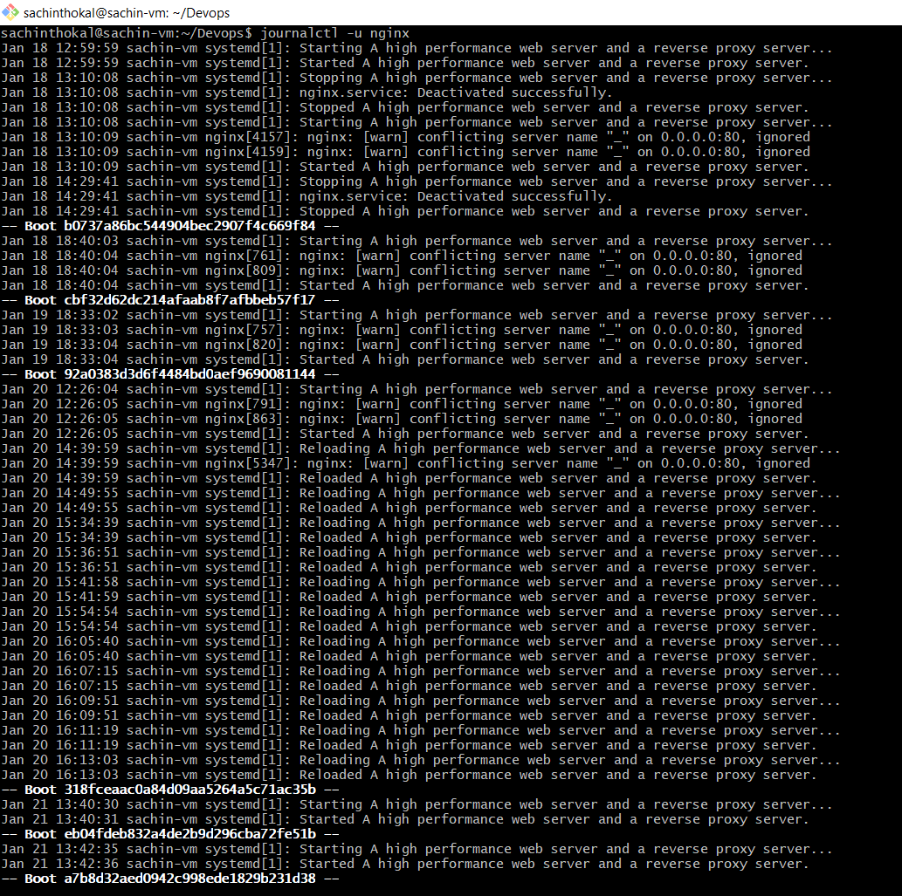
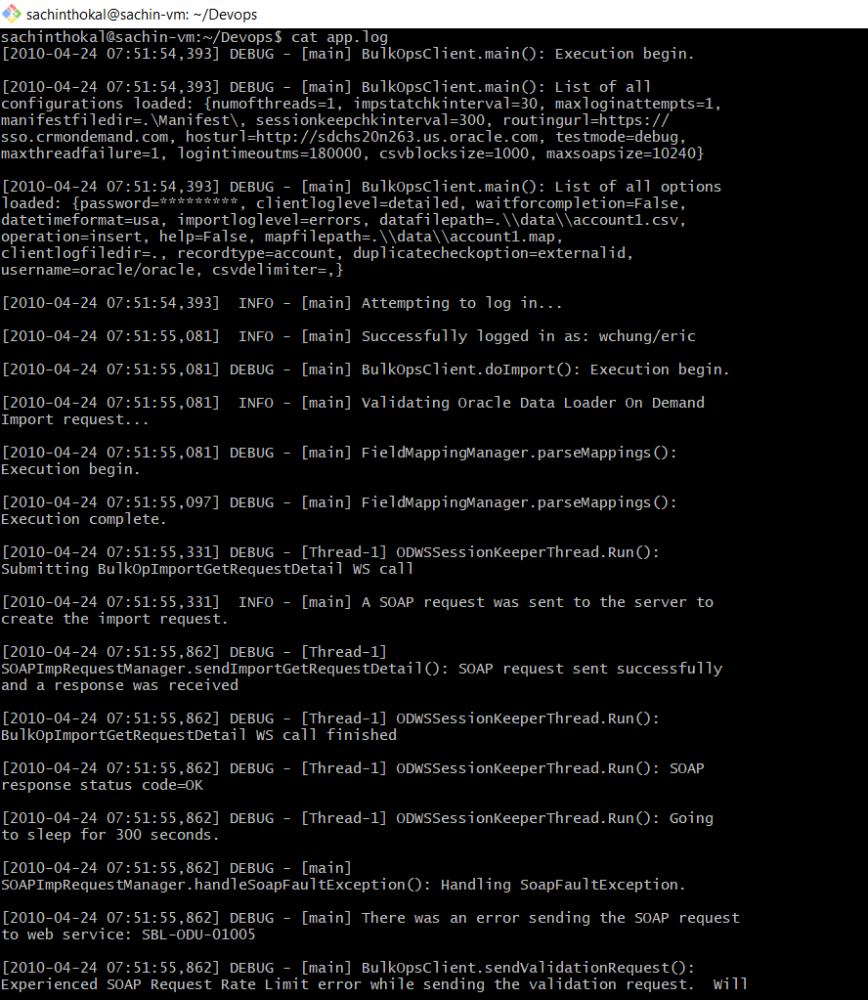
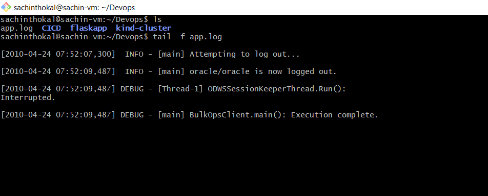

# Day 04 – Linux Practice: Processes and Services

## practice Linux fundamentals with real commands.

Running basic commands and capturing output :

- Check running processes

###  ps
```
output



```

### ps aux
```
output


    
```

### uptime
```
output


    
```

### top
```
output


    
```

### ls -la
```
output


    
```

### ip a
```
output


    
```

---

## Inspect one systemd service

###  systemctl status nginx
```
output


    
```

### journalctl -u nginx
```
output


    
```
---

### Log checks
---

### cat

```
output



```

### tail -f <log_filename>
```
output 


    
```

### grep "string to find"
```
output 


    
```

## Capture a small troubleshooting flow for cron

```bash

# 1. Check cron service
systemctl status cron 

# 2. Verify cron jobs
crontab -l

# 3. Use full paths
which df
/bin/df -h

# 4. Redirect output & errors
* * * * * /path/script.sh >> /tmp/cron.log 2>&1

# 5. Check cron logs
grep CRON /var/log/syslog    # Ubuntu

# 6. Check script permissions
ls -l script.sh
chmod +x script.sh

# 7. Test script manually
bash script.sh

```

---