# Linux-Troubleshooting-Runbook

### Step 0 : Understand the issue
```bash
    # Very Important

    - what is problem?
    - which service / app affected?
```
### STEP 1 : Check resources health
```bash
    # Capture a quick health snapshot [CPU, Memory, Disk, Network]
    # Note down observations from step 1

    Example
        - CPU : 1000m  --> 10%              # how much cpu used?
        - Memory : 10 MB --> 40%            # how much memory used?
        - Disk : 1000m --> 70%              # how much disk used?
        - Network --> 10 Mbps               # how much speed is there?
```
### STEP 2 : Trace Logs
```bash
    # Trace logs for that service 
    # Note down observations from step 2

    Example 
        - check if any error is there in logs   

```

### STEP 3 : Findings Or Results

```bash

    # Findings from step 1 & 2 make result
```

### STEP 4 : Action & Outcome
```bash
    # Make plan on situation and if apply what result will come?
    # Action & Outcome on Situation

```
# Example

## STEP 0 : Understand the issue

**Problem :** Seeing error while opening opensearch-dashboards.<br>
**Error :** OpenSearch Dashboards server is not ready yet.

## STEP 1 : Target service / process :  # opensearch-dashboards (opensearch)

#### Environment Info -

```bash
- uname -a                        # uname - print system information
- lsb_release -a                  # lsb_release - print distribution-specific information
- cat /etc/os-release             # cat -  cat - concatenate files and print on the standard output
```
##### Output :

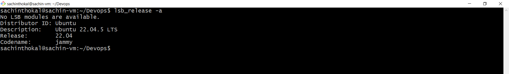
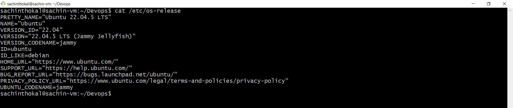
---

#### Service Health  -
```bash
    - sudo systemctl status opensearch-dashboards           # checked opensearch-dashboard service health
    - sudo systemctl status opensearch                      # checked opensearch engine service health

    # Note - opensearch-dashboard is using opensaerch engine in backend. so we checked both services status here. 

```
#### Output :

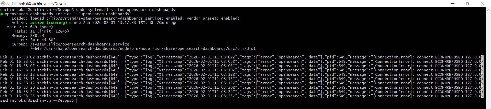
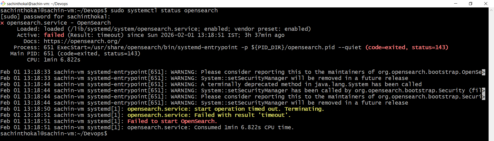
```bash
- Snapshot: CPU         - 1.3 %     # aservice used cpu
- Snapshot: Memory      - 1.6 %     # service used memory (RAM)
- Snapshot: Disk        - 0.22 %    # service used disk (SDD/HDD)
- Snapshot: Network     - Ok        # HTTP/1.1 200 OK
```
---
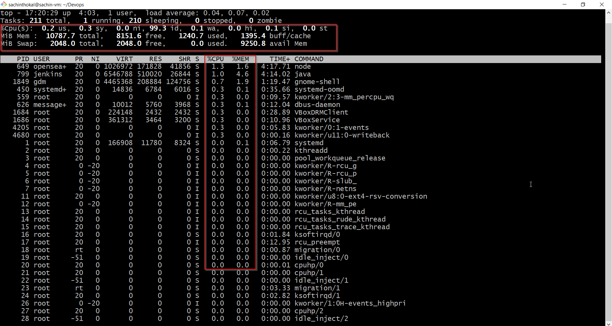

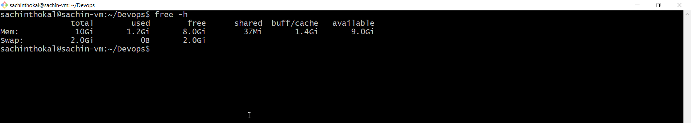

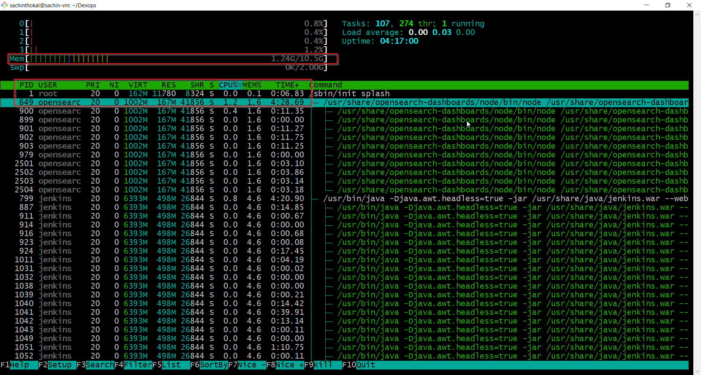

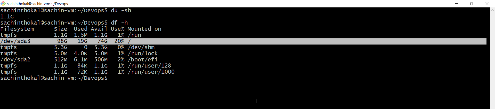

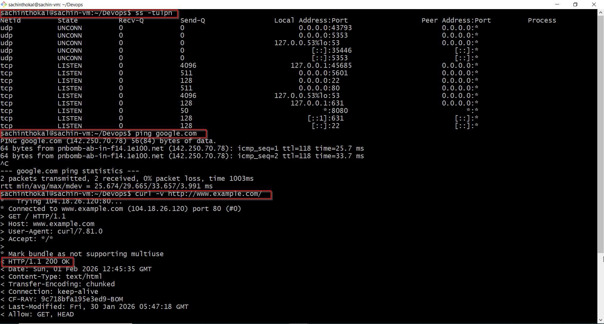

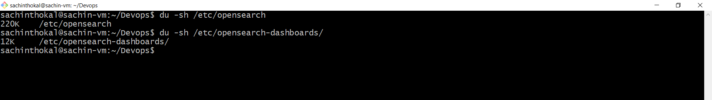

#### **Observations** :
```bash
    - We are seeing error in opensearch.    # ERROR
    - opensearch-dashboards is running fine. # GREEN
    - opensearch-dashboards is depend on opensearch backend and its show error (service is not up)
    - User using linux enviorment           # INFO
    - User using ubantu distribution        # INFO
    - service using 1.3% cpu, 1.6% ram, 0.22% disk # USAGE

    # conclusion - opensearch-dashboards is not getting started due to backend opensearch is not up.
```
---
Step 2 : Logs reviewed
---
```bash
- journalctl -u opensearch-dashboards -n 1 -o json-pretty
- journalctl -u opensearch -n 1 -o json-pretty

```
Logs - 
```json
opensearch-dashboards: 

sachinthokal@sachin-vm:~$ journalctl -u opensearch-dashboards -n 10 -o json-pretty
{
        "_STREAM_ID" : "7d77441698df41f8bca2c2d91403926e",
        "SYSLOG_FACILITY" : "3",
        "__CURSOR" : "s=5c67b54afac34d0dacd9428821c7e811;i=abd;b=68468aab32cc437abc05b3b8f04a171f;m=4bec2584;t=649c33fbcf604;x=fe7c03aece660899",
        "SYSLOG_IDENTIFIER" : "opensearch-dashboards",
        "_CAP_EFFECTIVE" : "0",
        "_SYSTEMD_UNIT" : "opensearch-dashboards.service",
        "_HOSTNAME" : "sachin-vm",
        "_COMM" : "node",
        "_UID" : "997",
        "_BOOT_ID" : "68468aab32cc437abc05b3b8f04a171f",
        "_MACHINE_ID" : "7541844c0b5a4782878ad22705c9b3f3",
        "_TRANSPORT" : "stdout",
        "_PID" : "640",
        "MESSAGE" : "{\"type\":\"log\",\"@timestamp\":\"2026-02-01T13:33:17Z\",\"tags\":[\"error\",\"opensearch\",\"data\"],\"pid\":640,\"message\":\"[ConnectionError]: connect ECONNREFUSED 127.0.0.1:9200\"}",
        "_SYSTEMD_CGROUP" : "/system.slice/opensearch-dashboards.service",
        "__MONOTONIC_TIMESTAMP" : "1273767300",
        "_EXE" : "/usr/share/opensearch-dashboards/node/bin/node",
        "__REALTIME_TIMESTAMP" : "1769952797062660",
        "_SELINUX_CONTEXT" : "unconfined\n",
        "_GID" : "996",
        "_SYSTEMD_INVOCATION_ID" : "37591266d4144f07ab60565644fb0337",
        "PRIORITY" : "6",
        "_SYSTEMD_SLICE" : "system.slice",
        "_CMDLINE" : "/usr/share/opensearch-dashboards/node/bin/node /usr/share/opensearch-dashboards/src/cli/dist"
}


opensearch :

sachinthokal@sachin-vm:~$ journalctl -u opensearch.service -o json-pretty
{
        "_COMM" : "systemd",
        "_MACHINE_ID" : "7541844c0b5a4782878ad22705c9b3f3",
        "CODE_FILE" : "src/core/job.c",
        "_TRANSPORT" : "journal",
        "_PID" : "1",
        "_SYSTEMD_SLICE" : "-.slice",
        "_SYSTEMD_CGROUP" : "/init.scope",
        "__REALTIME_TIMESTAMP" : "1769704496968270",
        "CODE_LINE" : "557",
        "TID" : "1",
        "_BOOT_ID" : "daa99eb4fa614dd0b45dda237d86515f",
        "MESSAGE_ID" : "7d4958e842da4a758f6c1cdc7b36dcc5",
        "CODE_FUNC" : "job_emit_start_message",
        "MESSAGE" : "Starting OpenSearch...",
        "_CAP_EFFECTIVE" : "1ffffffffff",
        "SYSLOG_IDENTIFIER" : "systemd",
        "_EXE" : "/usr/lib/systemd/systemd",
        "__MONOTONIC_TIMESTAMP" : "7334218149",
        "_SELINUX_CONTEXT" : "unconfined\n",
        "_HOSTNAME" : "sachin-vm",
        "__CURSOR" : "s=95c689a604d0415b851118dd66f9b6c8;i=2090;b=daa99eb4fa614dd0b45dda237d86515f;m=1b52749a5;t=649896fe6324e;x=df7fe390fcf30cf3",
        "_GID" : "0",
        "SYSLOG_FACILITY" : "3",
        "JOB_ID" : "3399",
        "_SYSTEMD_UNIT" : "init.scope",
        "JOB_TYPE" : "start",
        "_CMDLINE" : "/lib/systemd/systemd --system --deserialize 17 splash",
        "_UID" : "0",
        "PRIORITY" : "6",
        "UNIT" : "opensearch.service",
        "INVOCATION_ID" : "39cf73b1f28b45f284414bdd6eb22ba2",
        "_SOURCE_REALTIME_TIMESTAMP" : "1769704496967742"
}
```
#### **Observations** :
```bash
    - opensearch-dashboards is showing error in logs. # ERROR
    - opensearch-dashboards is not able to connect opensearch backend (opensearch service is not up)

    # conclusion - opensearch-dashboards is not getting started due to backend opensearch is not up.
```
---

Step 3 : Findings or Result

#### STEP 3 : Findings or Result :
```bash
    - opensearch-dashboards is showing error. # ERROR
    - opensearch-dashboards is not able to connect opensearch backend (opensearch service is not up)

    # conclusion - opensearch-dashboards is not getting started due to backend opensearch is not up and running.
```

## Step 4 : Action & Outcome - If this worsens (next steps)
```bash
    - sudo systemctl restart opensearch # opensearch-dashboards service is restarted.
    - sudo systemctl restart opensearch-dashboards # safer side opensearch-dashboards also restarted.

    # opensearch-dashboards is up and running
```
### **Outcome**
- Dashboard accessible
- Services healthy
---
#### Service Status 
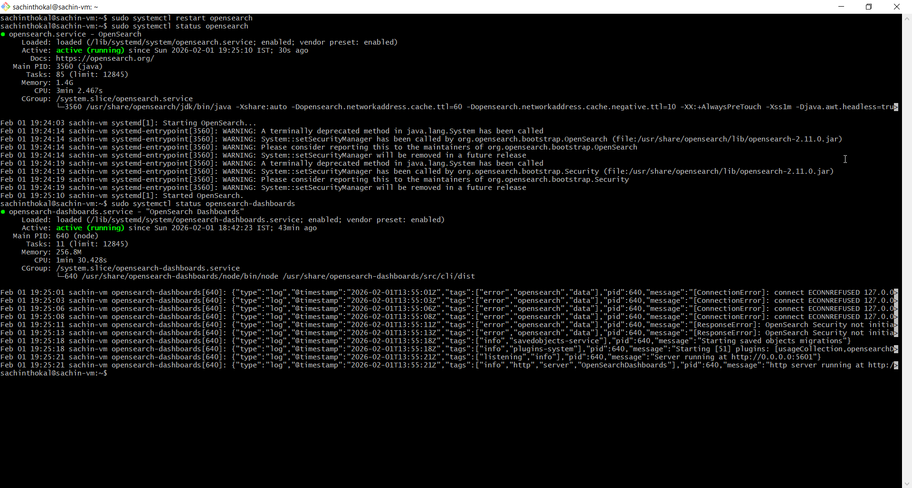

#### Service Logs
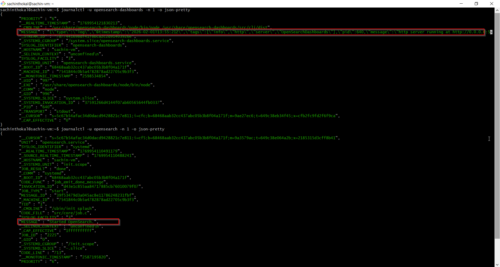

#### Service running 
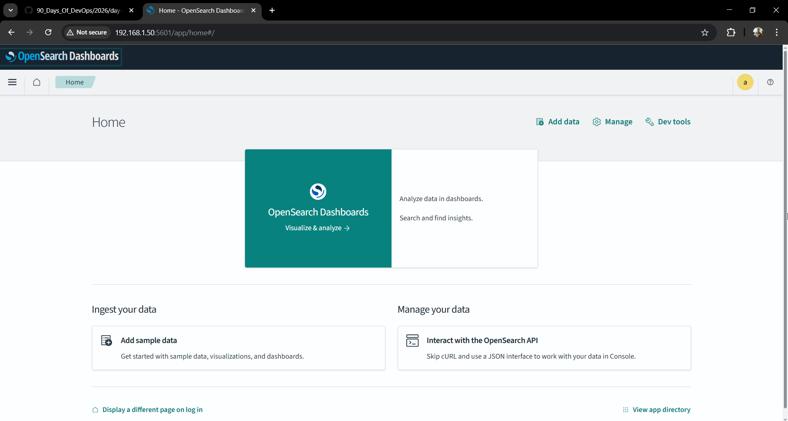

---
## Troubleshooting Tips ✅

```bash
“OpenSearch Dashboards was failing because backend OpenSearch was down.I identified it via logs and service status, restarted backend first, and validated recovery.”
```

## Interview Tip 🎯

```
I follow a structured 4-step troubleshooting approach:

Understand → Health Check → Logs → Action & Outcome
```

---