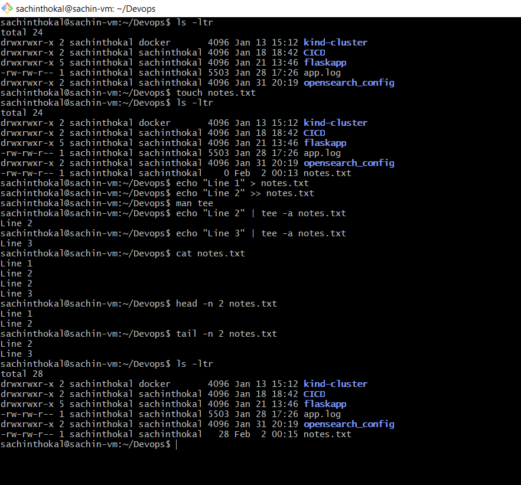

# Task : Linux Fundamentals: Read and Write Text Files

Run below command and capture output in file:

```bash
1. touch notes.txt
2. echo "Line 1" > notes.txt
3. echo "Line 2" >> notes.txt
4. echo "Line 3" | tee -a notes.txt
5. cat notes.txt
6. head -n 2 notes.txt
7. tail -n 2 notes.txt
```
---
## Output

