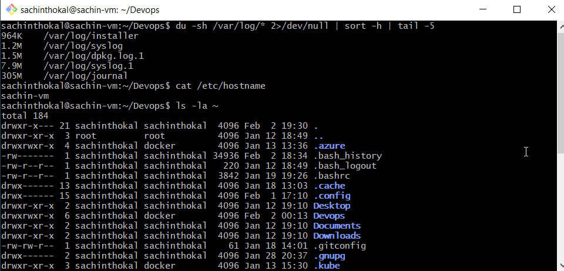
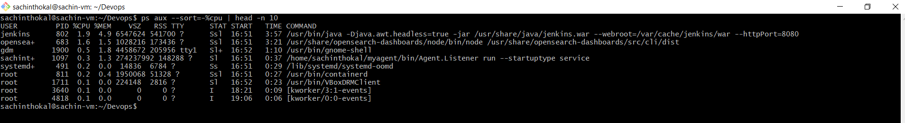
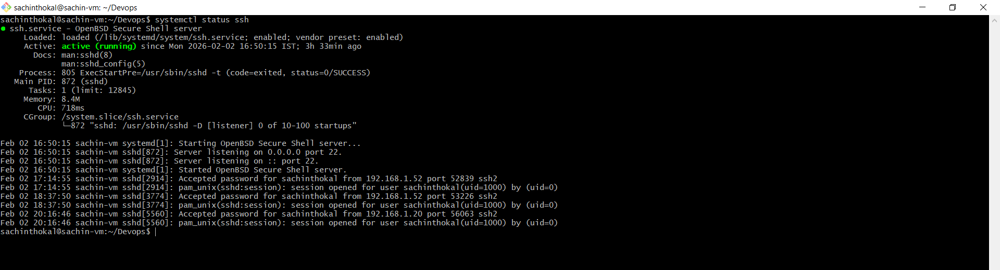
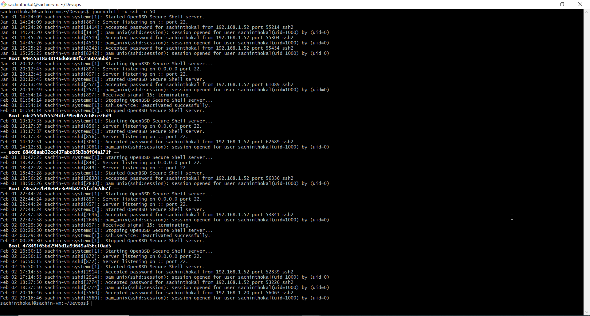
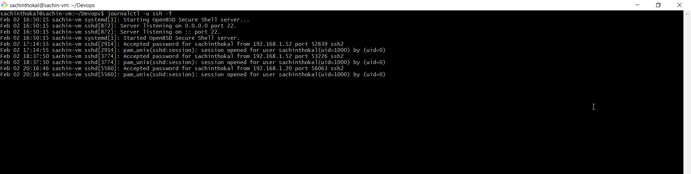

## Part 1: Linux File System Hierarchy
/(root) -
```bash
- I see lot's of files, links and directory are present under / (root dir).
```

/home -
```bash
- I see one user are present under /home dir.
```

/root -
```bash
- I see without super user permistions i am not able to enter in /root dir.
- when i tried with root user then i entered in /root dir.
- i see there are root levels files are there.
```

/etc -
```bash
- I see lot's of configuration files and folders under /etc.
- like systemd, sysctl.conf, shadow, ssl, etc..
```

/var/log -
```bash
- I see lot's of logs files are under /var/log/.
- like i see jenkins, nginx, opensearch and more..
```

/tmp -
```bash
- I see lot's of file are under /tmp.
```

/bin -
```bash
- I see lot's of file are under /bin.
- looks like all are cmd's or software's which is i installed or system build install.
```

/usr/bin -
```bash
- I see lot's of file are under /usr/bin.
- looks like all are cmd's or software's which is i installed or system build install.
```

/opt -
```bash
- I see some file are under /opt.
```
---

### TASK
```bash
# Find the largest log file in /var/log
du -sh /var/log/* 2>/dev/null | sort -h | tail -5

# Look at a config file in /etc
cat /etc/hostname

# Check your home directory
ls -la ~

```


---

## Part 2: Scenario-Based Practice

#### Scenario 1: Service Not Starting

A web application service called 'myapp' failed to start after a server reboot.
What commands would you run to diagnose the issue?
Write at least 4 commands in order.

Ans : 
```
Step 1: systemctl status myapp
Why: First i check the status of the service/app so i used this cmd.

Step 2: systemctl is-enabled myapp
Why: To check the service is enable or not at a on restart/reboot.

Step 3: journalctl -u -f myapp
Why: To check the service logs of my app.

```
---
#### Scenario 2: High CPU Usage

Your manager reports that the application server is slow.
You SSH into the server. What commands would you run to identify
which process is using high CPU?

Ans : 
```
Step 1: ssh username@<vm_ip>
Why: First i can do ssh on that server by using above cmd.

Step 2: top / htop / ps aux --sort=-%cpu | head -10
Why: sort the processes by high cpu usage and get top 10 lines

Step 3: Will take note down the PID and will do troubleshoot on them.
```


---
#### Scenario 3: Finding Service Logs

A developer asks: "Where are the logs for the 'docker' service?"
The service is managed by systemd.
What commands would you use?

Commands to explore:
```bash
# Check service status first
systemctl status ssh

# View last 50 lines of logs
journalctl -u ssh -n 50

# Follow logs in real-time
journalctl -u ssh -f

```




---
#### Scenario 4: File Permissions Issue

A script at /home/user/backup.sh is not executing.

When you run it: ./backup.sh
You get: "Permission denied"

What commands would you use to fix this?

Step-by-step solution structure:
```bash
Step 1: Check current permissions
Command: ls -l /home/user/backup.sh
Look for: -rw-r--r-- (notice no 'x' = not executable)

Step 2: Add execute permission
Command: chmod +x /home/user/backup.sh

Step 3: Verify it worked
Command: ls -l /home/user/backup.sh
Look for: -rwxr-xr-x (notice 'x' = executable)

Step 4: Try running it
Command: ./backup.sh
```