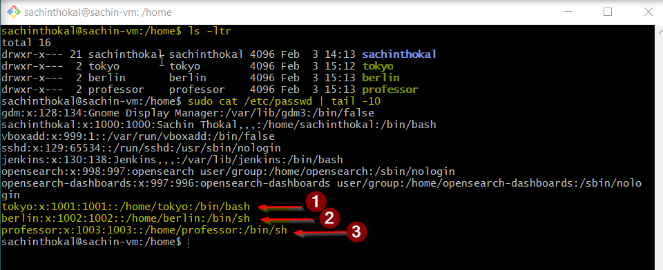
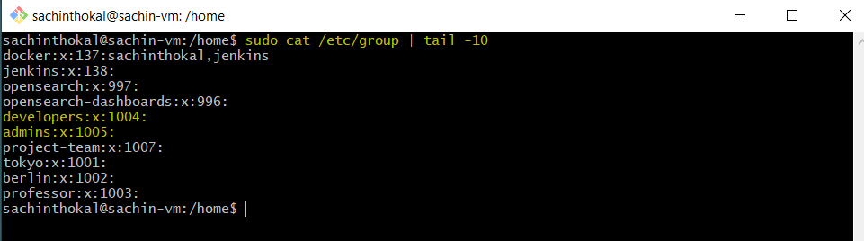
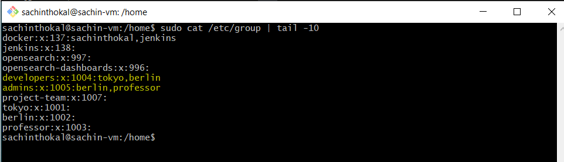
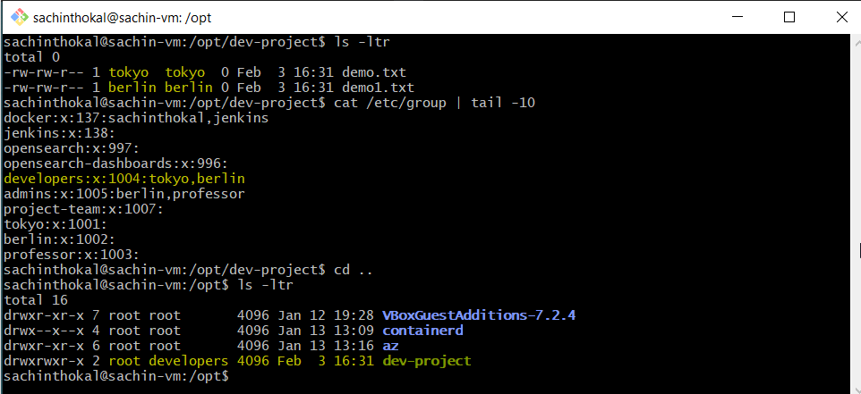
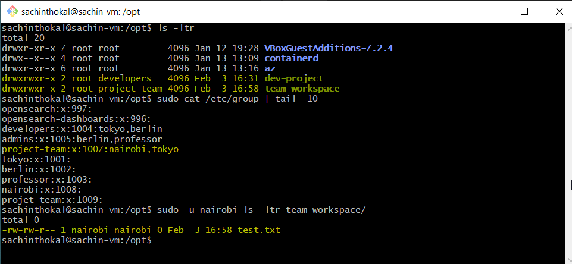

## Task 1: Create Users
```bash
# Create three users with home directories and passwords:

- tokyo
- berlin
- professor

# Verify: Check /etc/passwd and /home/ directory
```


---
## Task 2: Create Groups
```bash
# Create two groups:

- developers
- admins

# Verify: Check /etc/group
```


---
## Task 3: Assign to Groups
```bash
# Assign users:

tokyo → developers
berlin → developers + admins (both groups)
professor → admins

#Verify: Use appropriate command to check group membership
```


---
## Task 4: Shared Directory
```bash
# Create directory: /opt/dev-project

- Set group owner to developers
- Set permissions to 775 (rwxrwxr-x)
- Test by creating files as tokyo and berlin

#Verify: Check permissions and test file creation
```

```bash
Observation :

# tokyo and berlin in under developers group thats why both can able to create file under dev-project. else are not permiitted. 
```
---
## Task 5: Team Workspace
```
1. Create user nairobi with home directory
2. Create group project-team
3. Add nairobi and tokyo to project-team
4. Create /opt/team-workspace directory
5. Set group to project-team, permissions to 775
6. Test by creating file as nairobi
```
```bash
- sudo useradd -m nairobi
- sudo groupadd project-team
- sudo usermod -aG project-team nairobi
- sudo usermod -aG project-team tokyo
- sudo mkdir -p /opt/team-workspace
- sudo chgrp project-team team-workspace
- sudo chmod 775 team-workspace/
- sudo -u nairobi touch team-workspace/test.txt
```


---

## Documentation
```bash 
# Day 09 Challenge

## Users & Groups Created
- Users: tokyo, berlin, professor, nairobi
- Groups: developers, admins, project-team

## Group Assignments
- developers:x:1004:tokyo,berlin
- admins:x:1005:berlin,professor
- project-team:x:1007:nairobi,tokyo
- tokyo:x:1001:
- berlin:x:1002:
- professor:x:1003:
- nairobi:x:1008:
- projet-team:x:1009:


## Directories Created
- drwxrwxr-x  2 root developers   4096 Feb  3 16:31 dev-project
- drwxrwxr-x  2 root project-team 4096 Feb  3 16:58 team-workspace


## Commands Used
- sudo cat /etc/group | tail -10   # to view last 10 groups
- ls -la /opt/      # To view dir under opt


## What I Learned
- I learned how file/folders permissions works.
- How we can create/Modify/Delete User's
- How we can restricate permissions on files/dir's

```