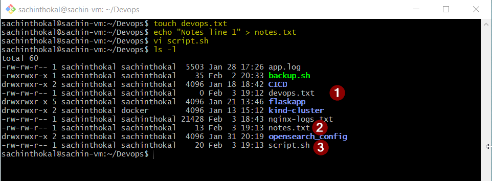
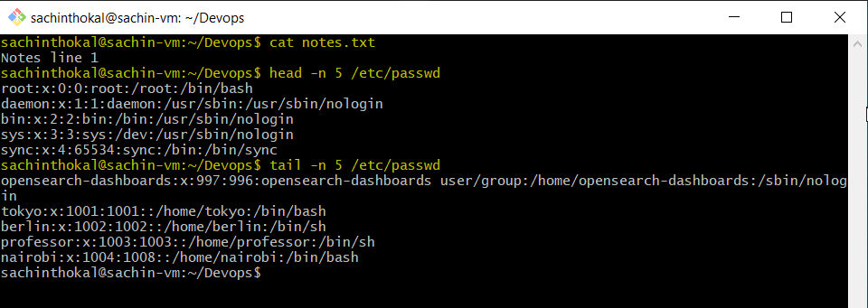
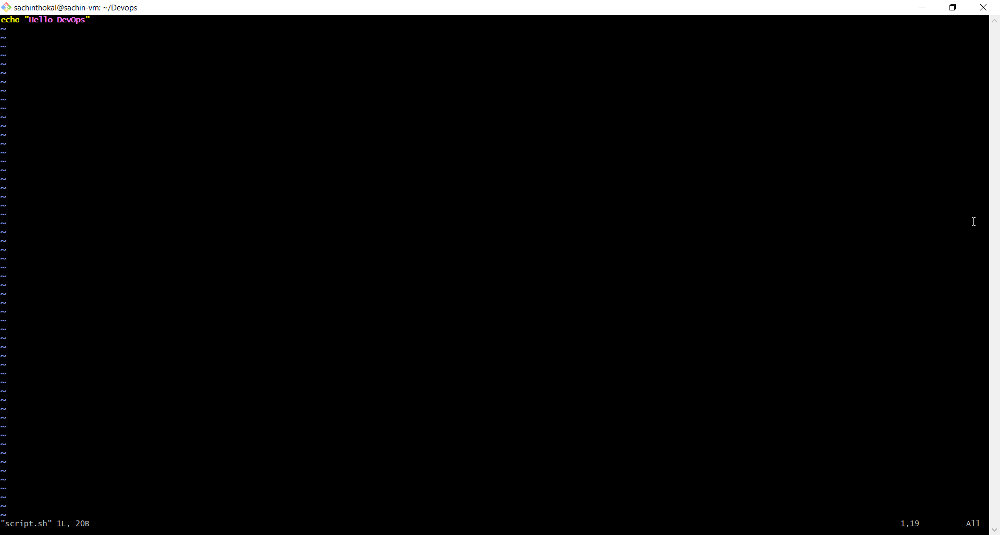
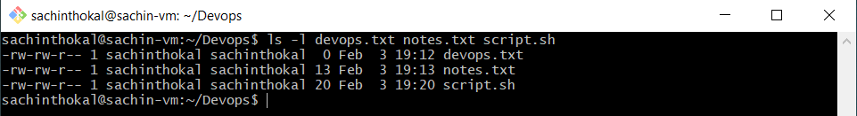
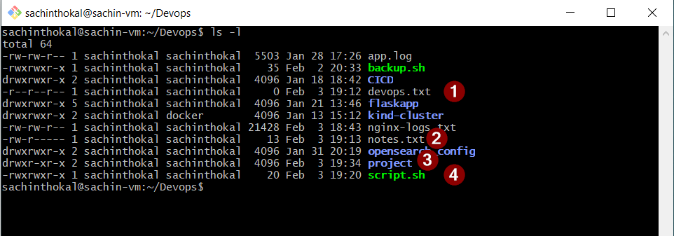

## Task 1: Create Files
```bash
    1. Create empty file devops.txt using touch
    2. Create notes.txt with some content using cat or echo
    3. Create script.sh using vim with content: echo "Hello DevOps"
# Verify: ls -l to see permissions
```


---

## Task 2: Read Files
```bash
    - Read notes.txt using cat
    - View script.sh in vim read-only mode
    - Display first 5 lines of /etc/passwd using head
    - Display last 5 lines of /etc/passwd using tail
```



---

## Task 3: Understand Permissions
```bash
- # r = read (4), w = write (2), x = execute (1)

- -rw-rw-r--

- All files have 664 Permissions

- Owner & Group are able to read and write. No execute permissions.

```


---

## Task 4: Modify Permissions
```bash
- sudo chmod +x script.sh # executable permissions

- sudo chmod 444 devops.txt # read-only (remove write for all)

- sudo chmod 640 notes.txt # 640 (owner: rw, group: r, others: none)

-  mkdir -p project     # Folder created 
-  chmod 755 project    # permissions 755

- ls -l     # List all files * folders

```


---

## Task 5: Test Permissions
```bash

    - sachinthokal@sachin-vm:~/Devops$ echo "Devops Lines Added" >> devops.txt
    # -bash: devops.txt: Permission denied

    - -r--r--r-- 1 sachinthokal sachinthokal    20 Feb  3 19:20 script.sh
    - sachinthokal@sachin-vm:~/Devops$ ./script.sh
    # -bash: ./script.sh: Permission denied
```

---

## What I Learned

```bash

- how to give needed permissions for files/folders
- how to modify the existing permissions
- Give require permissions
- permissions handling

```