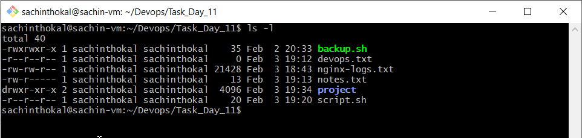
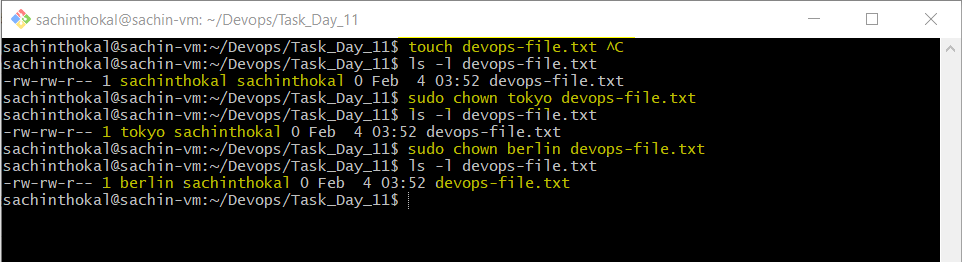
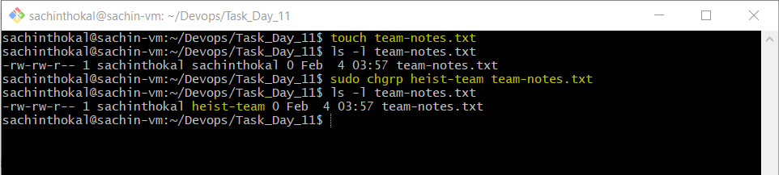
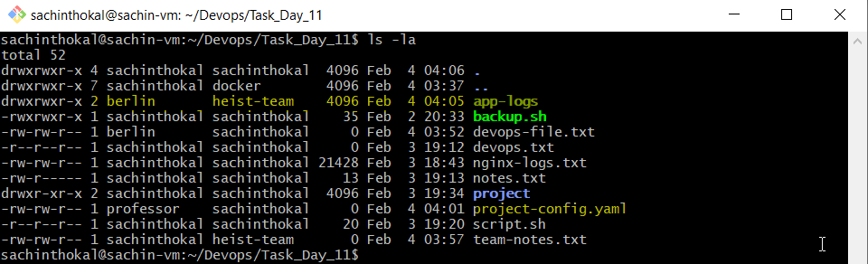
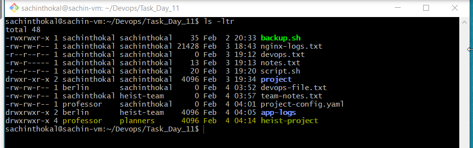
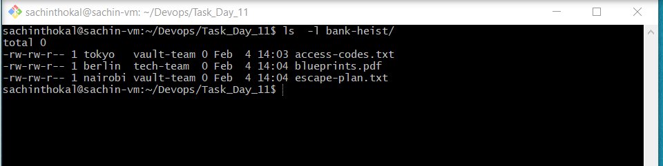

## Task 1: Understanding Ownership
```bash
1. Run ls -l in your home directory
2. Identify the owner and group columns
3. Check who owns your files

# Format: -rw-r--r-- 1 owner group size date filename
```


---
## Task 2: Basic chown Operations
```bash
1. Create file devops-file.txt
2. Check current owner: ls -l devops-file.txt
3. Change owner to tokyo (create user if needed)
4. Change owner to berlin
5. Verify the changes

Try: # sudo chown tokyo devops-file.txt
```



---
## Task 3: Basic chgrp Operations
```bash
- Create file team-notes.txt
- Check current group: # ls -l team-notes.txt
- Create group: # sudo groupadd heist-team
- Change file group to heist-team
- Verify the change
```



---

## Task 4: Combined Owner & Group Change 
```bash

Using chown you can change both owner and group together:

- Create file project-config.yaml
- Change owner to professor AND group to heist-team (one command)
- Create directory app-logs/
- Change its owner to berlin and group to heist-team
- Syntax: sudo chown owner:group filename
```


---

## Task 5: Recursive Ownership

```bash
mkdir -p heist-project/vault
mkdir -p heist-project/plans
touch heist-project/vault/gold.txt
touch heist-project/plans/strategy.conf
```

---

## Task 6: Practice Challenge
```bash
- Create users: tokyo, berlin, nairobi (if not already created)

- Create groups: vault-team, tech-team

- Create directory: bank-heist/

- Create 3 files inside:

    - touch bank-heist/access-codes.txt
    - touch bank-heist/blueprints.pdf
    - touch bank-heist/escape-plan.txt

- Set different ownership:

    - access-codes.txt → owner: tokyo, group: vault-team
    - blueprints.pdf → owner: berlin, group: tech-team
    - escape-plan.txt → owner: nairobi, group: vault-team
```
Verify: ls -l bank-heist/
```bash
# Chnage Owner
- sudo chown professor heist-project/
- sudo chown tokyo bank-heist/access-codes.txt
- sudo chown berlin bank-heist/blueprints.pdf
- sudo chown nairobi bank-heist/escape-plan.txt

# Chnage Group Owner

- sudo chgrp planners heist-project/
- sudo chgrp vault-team bank-heist/access-codes.txt
- sudo chgrp tech-team bank-heist/blueprints.pdf
- sudo chgrp vault-team bank-heist/escape-plan.txt

```


---

Key Commands Reference
```bash
# View ownership
ls -l filename

# Change owner only
sudo chown newowner filename

# Change group only
sudo chgrp newgroup filename

# Change both owner and group
sudo chown owner:group filename

# Recursive change (directories)
sudo chown -R owner:group directory/

# Change only group with chown
sudo chown :groupname filename
```
---

## What I Learned
- How to chnage group owner.
- How to chnage Owner 
- How to access files

---