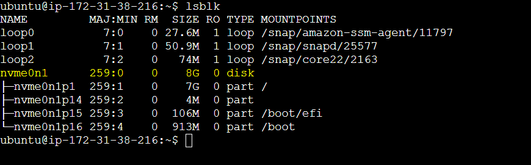
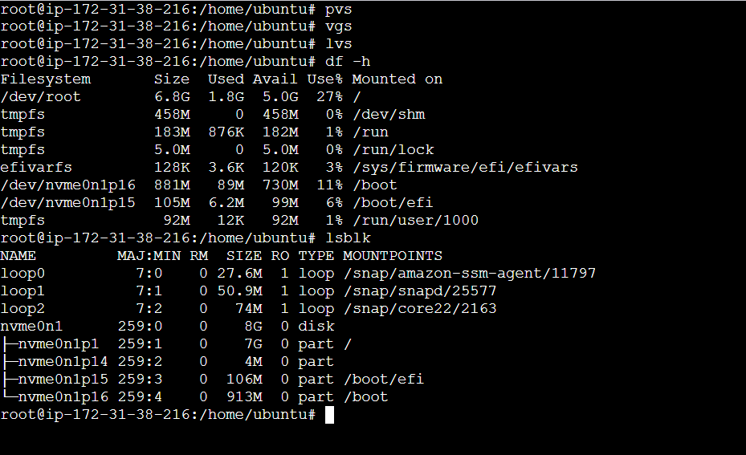
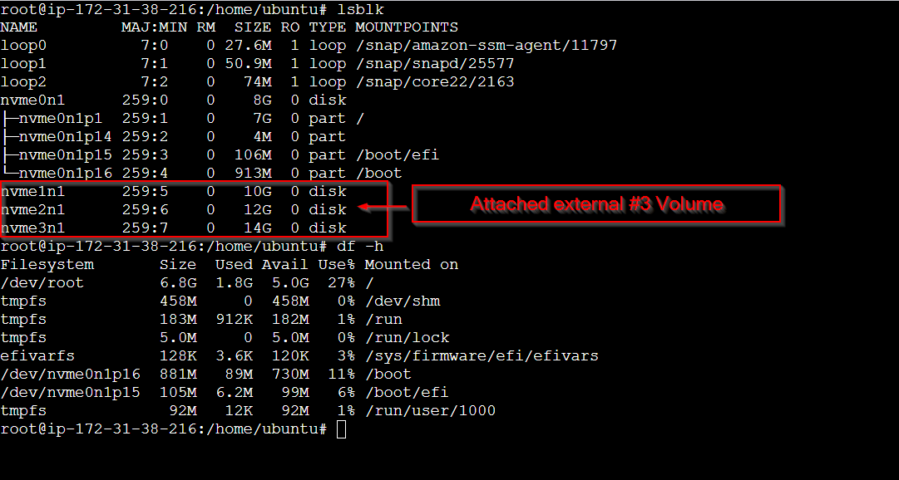
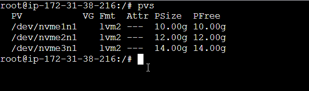
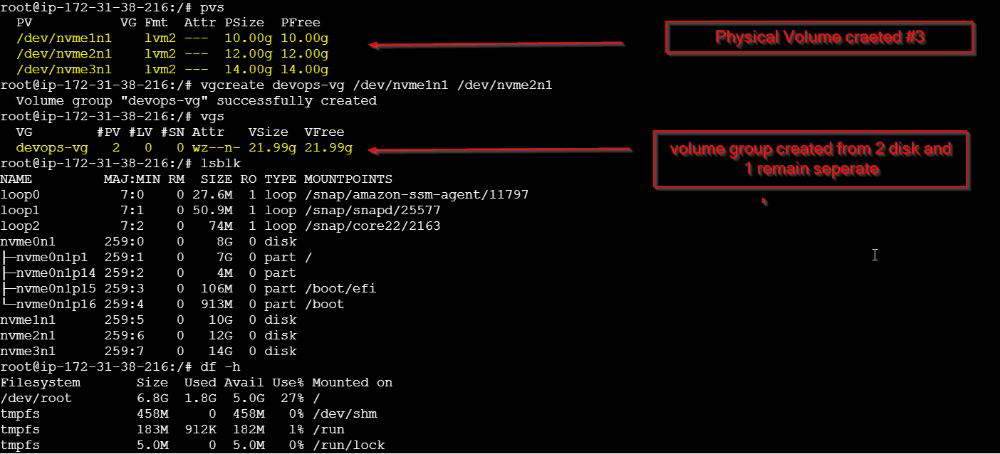
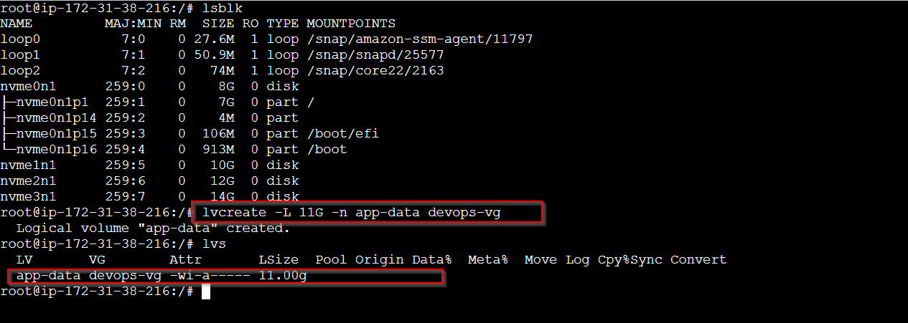
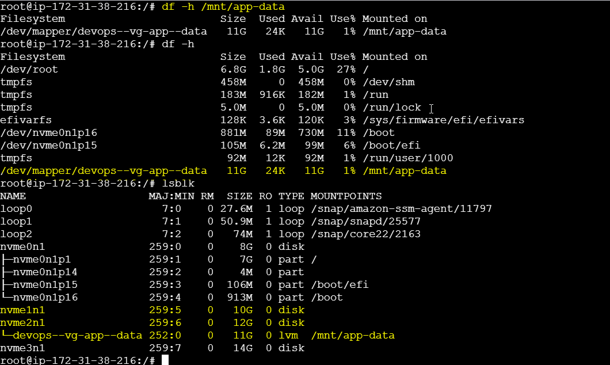
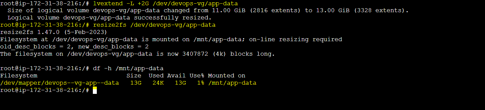

## Task : LVM to manage storage flexibly – create, extend, and mount volumes.

#### Task 1: Check Current Storage
Run: lsblk, pvs, vgs, lvs, df -h




---
#### Task 2: Create Physical Volume

```bash
pvcreate /dev/nvme1n1
pvcreate /dev/nvme2n1
pvcreate /dev/nvme3n1   # or your loop device

pvs
```




---

#### Task 3: Create Volume Group
```bash
- vgcreate devops-vg  
- vgcreate devops-vg /dev/nvme1n1 /dev/nvme2n1
- vgs
```


---
#### Task 4: Create Logical Volume

lvcreate -L 500M -n app-data devops-vg
lvs
```bash
- lvcreate -L 11G -n app-data devops-vg
```


---

#### Task 5: Format and Mount
```bash
- mkfs.ext4 /dev/devops-vg/app-data
- mkdir -p /mnt/app-data
- mount /dev/devops-vg/app-data /mnt/app-data
- df -h /mnt/app-data
```


#### Task 6: Extend the Volume
```bash
lvextend -L +200M /dev/devops-vg/app-data
resize2fs /dev/devops-vg/app-data
df -h /mnt/app-data
```


---

#### What you learned (3 points)

```bash
- I learn how to create volume
- I learn how to create physical volume
- I learn how to create logical volume
- I learn how to extend volume

```