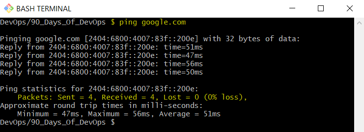
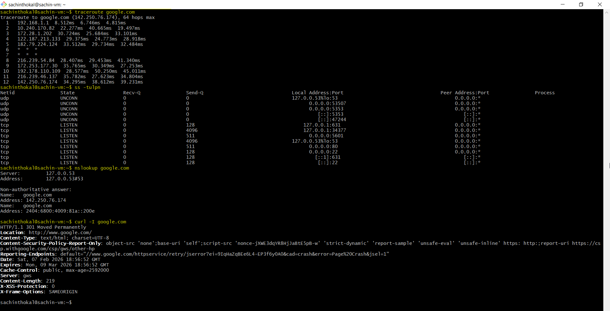
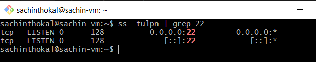
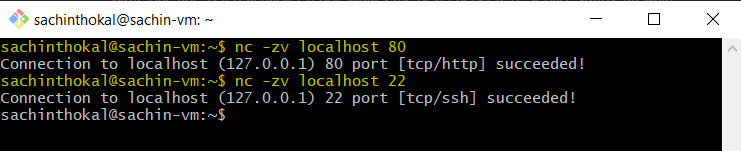

### Quick Concepts
```bash
- OSI layers (L1–L7) vs TCP/IP stack (Link, Internet, Transport, Application)

Breakdown:

A – Application Layer              

P – Presentation Layer              

S – Session Layer                 

T – Transport Layer                 

N – Network Layer                   

D – Data Link Layer                 

P – Physical Layer       


# A Pretty Smart Teacher Never Drinks Pepsi


- Where IP, TCP/UDP, HTTP/HTTPS, DNS sit in the stack
    - IP stay in Network layer
    - TCP/UDP stay in Transport layer
    - HTTP/HTTPS stay in Application layer
    - DNS stay in Application layer

- One real example: “curl https://example.com = App layer over TCP over IP”


```
---
### Hands-on Checklist 
```bash
- Identity: hostname -I (or ip addr show) — note your IP.
    - #  

- Reachability: ping <target> — mention latency and packet loss.
    - # Pinging google.com [2404:6800:4007:83f::200e] with 32 bytes of data:
        # Reply from 2404:6800:4007:83f::200e: time=51ms
        # Reply from 2404:6800:4007:83f::200e: time=47ms
        # Reply from 2404:6800:4007:83f::200e: time=56ms
        # Reply from 2404:6800:4007:83f::200e: time=50ms

    - # Packets: Sent = 4, Received = 4, Lost = 0 (0% loss),

- Path: traceroute <target> (or tracepath) — note any long hops/timeouts.
# sachinthokal@sachin-vm:~$ traceroute google.com
traceroute to google.com (142.250.76.174), 64 hops max
  1   192.168.1.1  7.745ms  2.784ms  13.144ms # MY Laptop GW IP
  2   10.240.170.82  71.375ms  73.298ms  63.683ms # MY Router IP
  3   172.28.1.202  95.903ms  105.667ms  97.467ms # Private IP
  4   182.79.50.133  70.224ms  60.870ms  41.999ms # Bharti Airtel Ltd. Delhi 
  5   116.119.161.131  48.260ms  44.667ms  56.648ms # Bharti Telesonic Mumbai 
  6   *  *  *
  7   *  *  *
  8   142.250.235.8  87.029ms  96.301ms  109.848ms # Google LLC California
  9   192.178.253.210  128.998ms  137.026ms  127.268ms  # Google LLC California
 10   142.250.76.174  131.641ms  192.178.110.205  136.379ms  112.573ms # Google LLC Mumbai

- Ports: ss -tulpn (or netstat -tulpn) — list one listening service and its port.

    - sachinthokal@sachin-vm:~$ ss -tulpn
    # Netid  State   Recv-Q  Send-Q   Local Address:Port    Peer Address:Port Process
    - udp    UNCONN  0       0        127.0.0.53%lo:53           0.0.0.0:*
    - tcp    LISTEN  0       128               [::]:22              [::]:*

- Name resolution: dig <domain> or nslookup <domain> — record the resolved IP.

    # sachinthokal@sachin-vm:~$ nslookup google.com
    Server:         127.0.0.53
    Address:        127.0.0.53#53

    Non-authoritative answer:
    Name:   google.com
    Address: 142.250.76.174
    Name:   google.com
    Address: 2404:6800:4009:81a::200e

- HTTP check: curl -I <http/https-url> — note the HTTP status code.

# sachinthokal@sachin-vm:~$ curl -I google.com
HTTP/1.1 301 Moved Permanently
Location: http://www.google.com/
Content-Type: text/html; charset=UTF-8
Content-Security-Policy-Report-Only: object-src 'none';base-uri 'self';script-src 'nonce-kcBz84IICPaOAQHdEZfVbg' 'strict-dynamic' 'report-sample' 'unsafe-eval' 'unsafe-inline' https: http:;report-uri https://csp.withgoogle.com/csp/gws/other-hp
Reporting-Endpoints: default="//www.google.com/httpservice/retry/jserror?ei=dIqHaeqlIZuR4-EPnY6GkQQ&cad=crash&error=Page%20Crash&jsel=1"
Date: Sat, 07 Feb 2026 18:54:44 GMT
Expires: Mon, 09 Mar 2026 18:54:44 GMT
Cache-Control: public, max-age=2592000
Server: gws
Content-Length: 219
X-XSS-Protection: 0
X-Frame-Options: SAMEORIGIN


```



---

### Mini Task: Port Probe & Interpret

Identify one listening port from ss -tulpn (e.g., SSH on 22 or a local web app).



From the same machine, test it: nc -zv localhost <port> (or curl -I http://localhost:<port>).



Write one line: is it reachable? If not, what’s the next check? (e.g., service status, firewall).
I see it's connected.

---