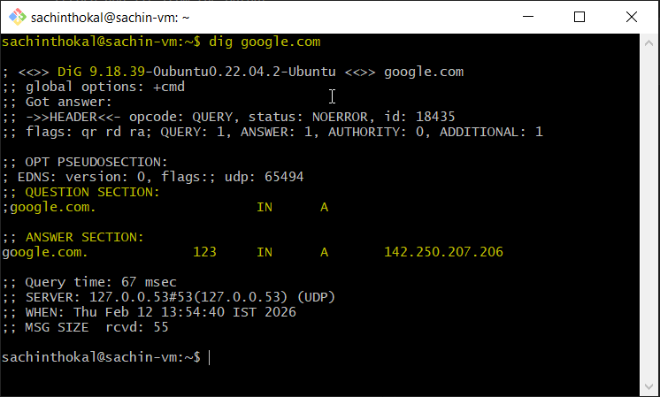
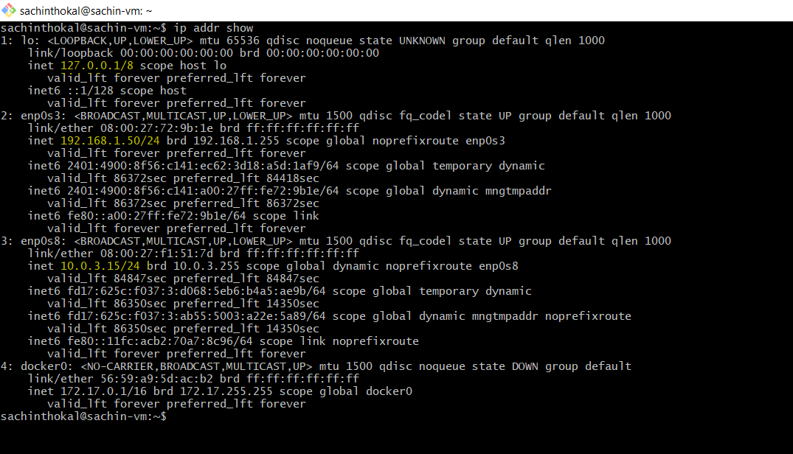
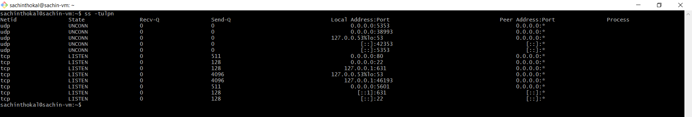

## Task 1: DNS – How Names Become IPs
Explain in 3–4 lines: what happens when you type google.com in a browser?
```bash
- When we type google.com, browser sent request to DNS server to check IP.

- DNS will convert google.com to IP address and give back to broswer.

- Broswer sent http/https request to on that IP.

- Then google.com response back with webpage to browser.

```
What are these record types? Write one line each: A, AAAA, CNAME, MX, NS
```bash
A Record – Give IPv4 address to domain name.

AAAA Record – Give IPv6 address to domain name.

CNAME – One domain redirect to another domain

MX – #

NS – Tell us which dns server will used for which domain.
```
Run: dig google.com — identify the A record and TTL from the output
```bash
# dig google.com

This give us -

- A record(IPV4 address)
- TTL
- DNS Server answered

```


---

## Task 2: IP Addressing
What is an IPv4 address? How is it structured? (e.g., 192.168.1.10)
```bash
- An IPv4 address is a 32-bit numeric address used to uniquely identify a device on a network.
# e.g  192.168.1.10

- This is 32 bit address
- IP is diveded in 4 (octets) parts.
- every part range is 0 - 255.

# 192 . 168 . 1 . 10
# |     |     |     |
# 8bit  8bit  8bit  8bit

```
Difference between public and private IPs — give one example of each
```bash
1. Public IP
    - Used on the internet
    - Globally unique
    - Assigned by ISP

    # Example:
    # 8.8.8.8 (Google DNS)

2. Private IP
    - Used inside local networks (home, office)
    - Not reachable directly from the internet
    - Reused in many networks

    # Example:
    # 192.168.1.10

```
What are the private IP ranges?
10.x.x.x, 172.16.x.x – 172.31.x.x, 192.168.x.x
```bash
# 10.0.0.0 – 10.255.255.255 → 10.x.x.x

# 172.16.0.0 – 172.31.255.255 → 172.16.x.x – 172.31.x.x

# 192.168.0.0 – 192.168.255.255 → 192.168.x.x
```
Run: ip addr show — identify which of your IPs are private
```bash
# ip addr show

```


---

## Task 3: CIDR & Subnetting
What does /24 mean in 192.168.1.0/24?
```bash

# /24 means 24 bits are used for the network portion of the IP address.

Since IPv4 is 32 bits total:

24 bits → Network
8 bits → Host

```
How many usable hosts in a /24? A /16? A /28?
```bash
Trick to remember:
/24 = ?
# 32 - 24 = 8 host bits
# 2⁸ = 256
# 256 - 2 = 254 usable hosts

| CIDR | Total IPs | Usable |
| ---- | --------- | ------ |
| /24  | 256       | 254    |
| /16  | 65K       | 65,534 |
| /28  | 16        | 14     |

```
Explain in your own words: why do we subnet?
```bash

Subnet to:

    - Divide a large network into smaller networks

    - Improve security

    - Reduce broadcast traffic

    - Better IP address management

    - Organize departments (HR, IT, Finance separate networks)

# 👉 In short: Subnetting improves network performance and control.

```
Quick exercise — fill in:
```bash
C| CIDR | Subnet Mask     | Total IPs | Usable Hosts |
| ---- | --------------- | --------- | ------------ |
| /24  | 255.255.255.0   | 256       | 254          |
| /16  | 255.255.0.0     | 65,536    | 65,534       |
| /28  | 255.255.255.240 | 16        | 14           |

```
---
## Task 4: Ports – The Doors to Services
What is a port? Why do we need them?
```bash
- A port is a logical number that identifies which service/application is running on a system.

# IP address सांगतो कोणत्या मशीनकडे जायचं

# Port number सांगतो त्या मशीनवर कोणत्या service कडे जायचं
```
Document these common ports:
```bash
|  Port | Service | Explanation                    |
| ----: | ------- | ------------------------------ |
|    22 | SSH     | Secure remote login to servers |
|    80 | HTTP    | Web traffic (non-secure)       |
|   443 | HTTPS   | Secure web traffic             |
|    53 | DNS     | Domain name resolution         |
|  3306 | MySQL   | MySQL database                 |
|  6379 | Redis   | In-memory cache/database       |
| 27017 | MongoDB | MongoDB database               |

```
Run ss -tulpn — match at least 2 listening ports to their services
```bash
ss -tulpn

- Listening ports
- Protocol (TCP/UDP)
- Which service/process is using the port
```


---
## Task 5: Putting It Together
Answer in 2–3 lines each:

You run curl http://myapp.com:8080 — what networking concepts from today are involved?
```bash

# curl http://myapp.com:8080
We are sending curl request from browser to myapp.com on 8080 port.

networking concepts from today are involved below
- Hitting myapp.com means DNS resolution happened and browser will get IP.

- We using port 8080 means we are using port on 8080 ( specific service on that port)
```
Your app can't reach a database at 10.0.1.50:3306 — what would you check first?

```bash
First we will check that IP/Port are accessable for that 
- will try ping to that IP
- will check port is open in Firewall
- will check port mapping
```
## I learned 
```bahs
- How DNS worked
- How IP mapped to DNS
- How Subnets worked 
- How Ports are mapped
```

---