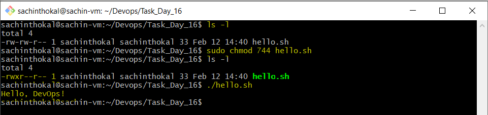
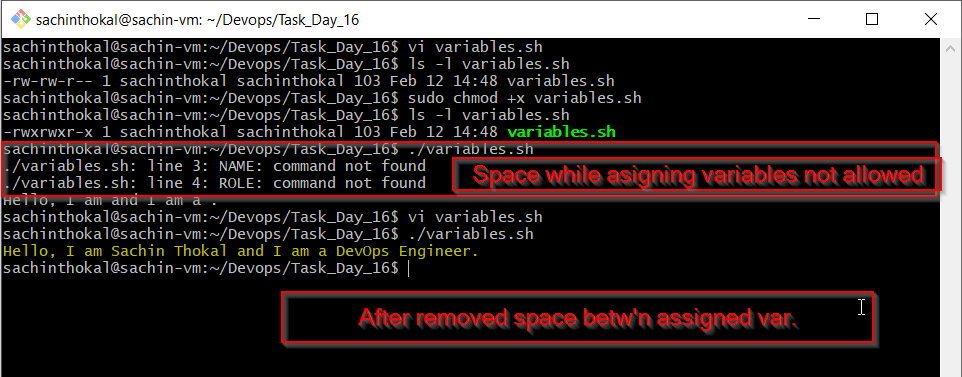
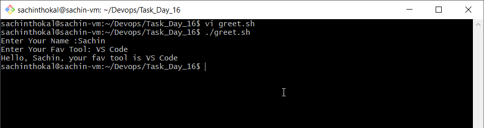
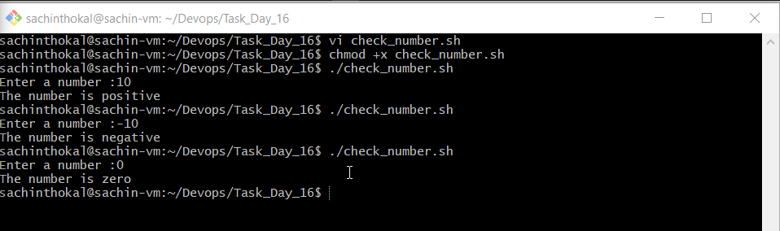
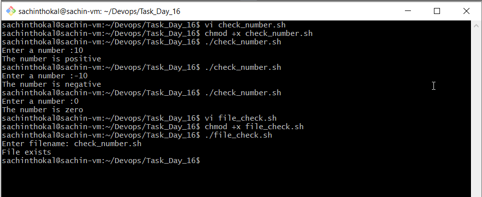
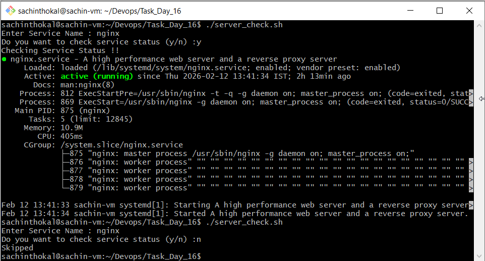

## Task 1: Your First Script
```bash
- Create a file hello.sh
- Add the shebang line #!/bin/bash at the top
- Print Hello, DevOps! using echo
- Make it executable and run it
- chmod +x hello.sh
- ./hello.sh
```

Document: What happens if you remove the shebang line?
```bash
#!/bin/bash
It tells the OS which interpreter should run the script.

- he OS does not know which interpreter to use
- Script may fail
- Default shell may be used (unexpected behavior)

# Removing the shebang means the OS doesn’t know how to execute the script unless an interpreter is explicitly provided.
```
---

## Task 2: Variables
```
Create variables.sh with:
A variable for your NAME

A variable for your ROLE (e.g., "DevOps Engineer")

Print: Hello, I am <NAME> and I am a <ROLE>

Try using single quotes vs double quotes — what's the difference?
```
| Feature              | Single Quotes | Double Quotes |
| -------------------- | ------------- | ------------- |
| Variable expansion   | ❌ No          | ✅ Yes         |
| Command substitution | ❌ No          | ✅ Yes         |
| Literal text         | ✅ Yes         | ❌ No          |

# Example Double Quotes " " VS Single Quotes ' '

1) name="Sachin"
echo "Hello $name"

✅ Output: Hello Sachin

2) name="Sachin"
echo 'Hello $name'

✅ Output: Hello $name 

```bash
# Single quotes treat everything literally, while double quotes allow variable and command expansion.
```



---

## Task 3: User Input with read
- Create greet.sh that:
- Asks the user for their name using read
- Asks for their favourite tool
- Prints: Hello <name>, your favourite tool is <tool>
```bash
-  vi greet.sh
-  sudo chmod +x greet.sh
- ./greet.sh

```


---

## Task 4: If-Else Conditions

1. Create check_number.sh that:

- Takes a number using read
- Prints whether it is positive, negative, or zero

2. Create file_check.sh that:

- Asks for a filename
- Checks if the file exists using -f
- Prints appropriate message`

```bash
1 - vi check_number.sh
2 - Enter below code

#!/bin/bash

read -p "Enter a number: " num

if [ "$num" -gt 0 ]; then
    echo "The number is positive"
elif [ "$num" -lt 0 ]; then
    echo "The number is negative"
else
    echo "The number is zero"
fi

3 - chmod +x check_number.sh
4 - ./check_number.sh

```



---

## Task 5: Combine It All
```bash
# Create server_check.sh that:

- Stores a service name in a variable (e.g., nginx, sshd)

- Asks the user: "Do you want to check the status? (y/n)"
- If y — runs systemctl status <service> and prints whether it's active or not
- If n — prints "Skipped."
```


---
## What I learned (3 key points)
```bash
- To write bash script
- how to handel small task by using scripts
- Script & Perimisstions
```
---