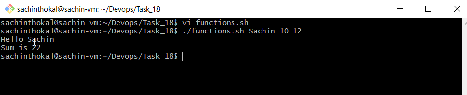
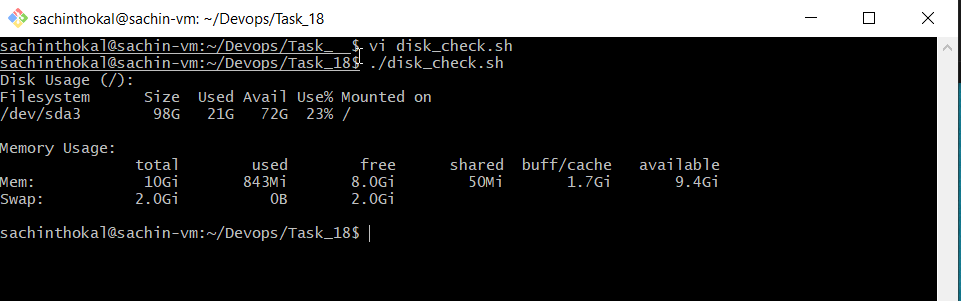
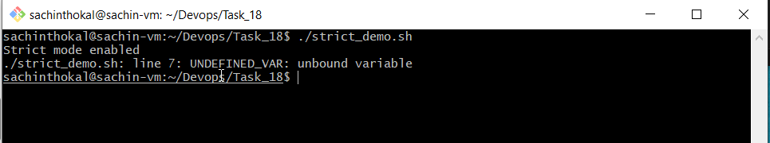
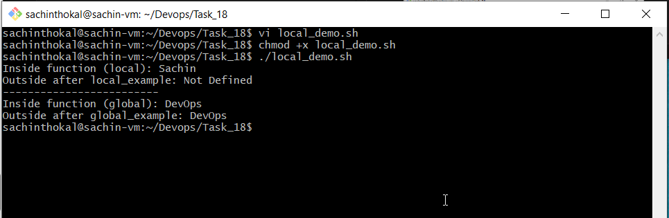
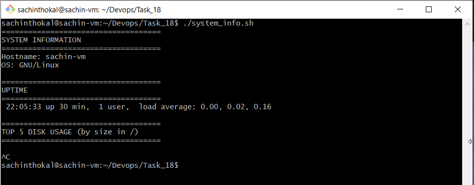

#### Task 1: Basic Functions1
1. Create functions.sh with:

#### Task 2: Functions with Return Values

#### Task 3: Strict Mode — set -euo pipefail

#### Task 4: Local Variables

#### Task 5: Build a Script — System Info Reporter

---