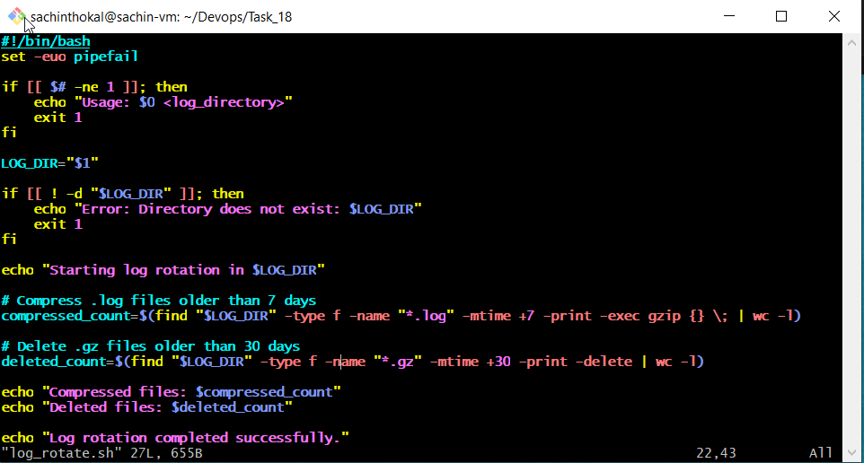
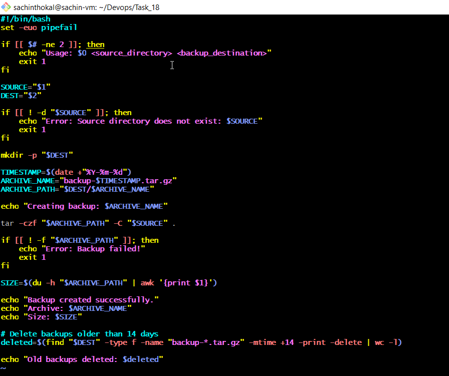
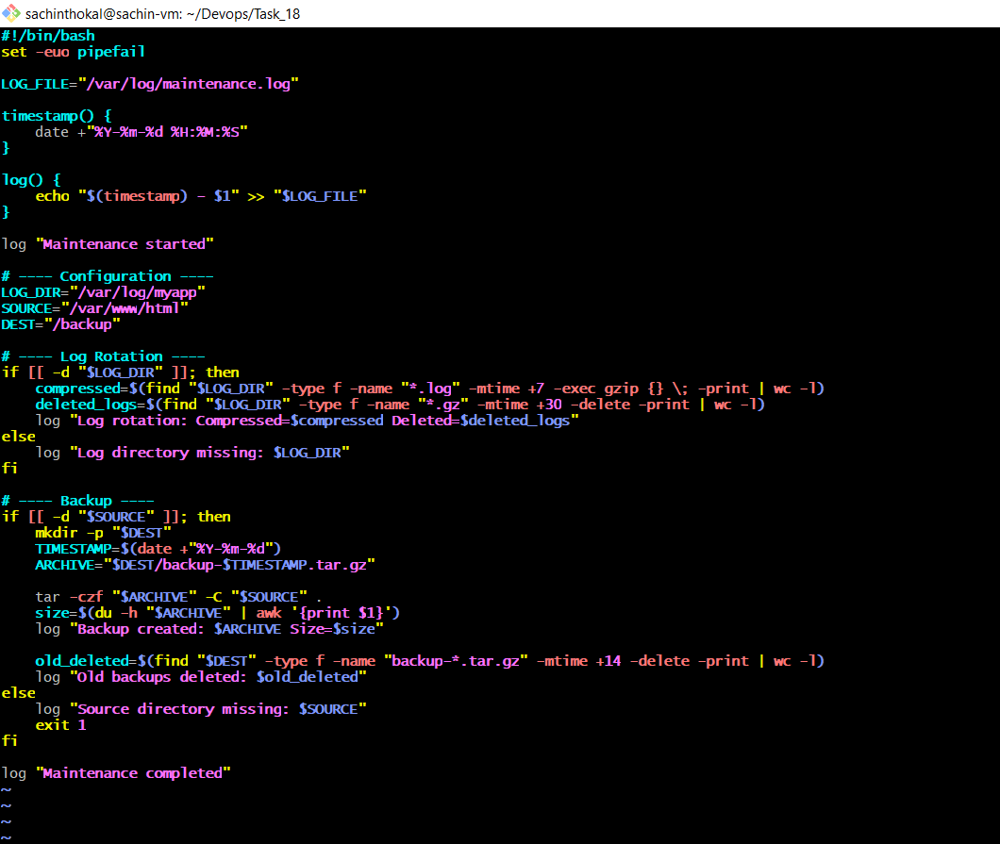

#### Task 1: Log Rotation Script

#### Task 2: Server Backup Script

#### Task 3: Crontab
Read: crontab -l — what's currently scheduled?
Understand cron syntax:
* * * * *  command
│ │ │ │ │
│ │ │ │ └── Day of week (0-7)
│ │ │ └──── Month (1-12)
│ │ └────── Day of month (1-31)
│ └──────── Hour (0-23)
└────────── Minute (0-59)

#### Task 4: Combine — Scheduled Maintenance Script

---