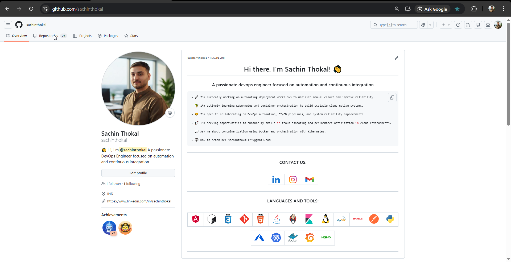
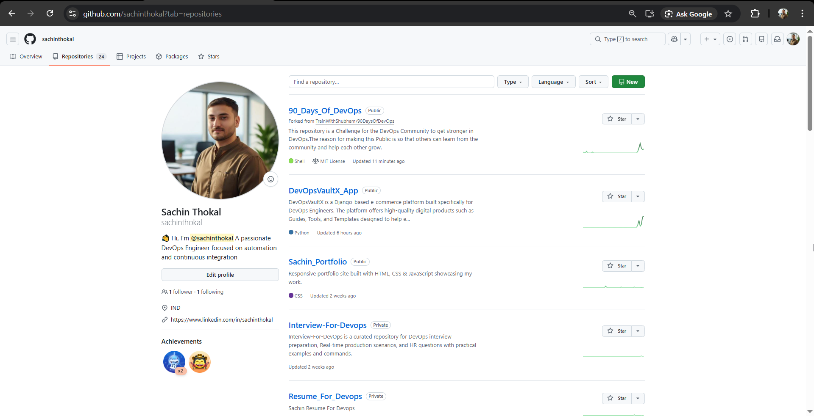
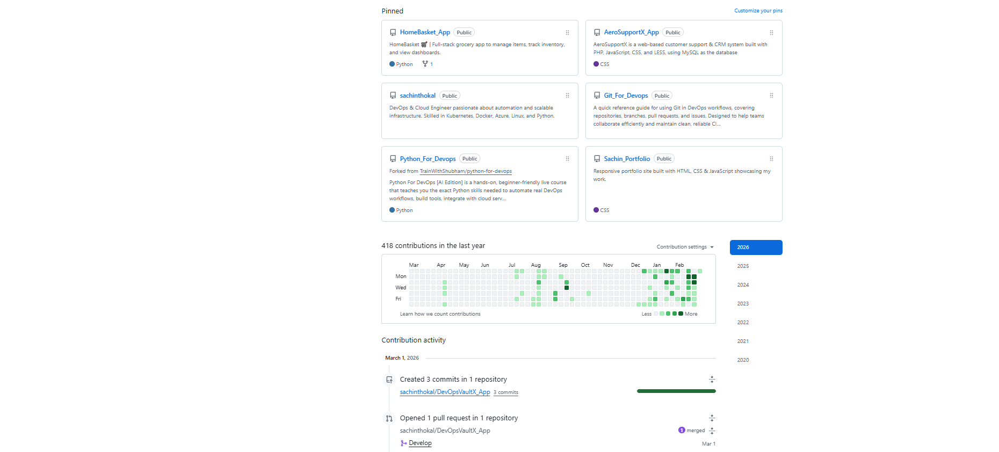

# Day 27: GitHub Profile Branding & Organization

## Task 1: Self-Audit (The Stranger Test)
* **Impression:** Before today, my profile looked like a collection of school assignments and random forks. It didn't clearly state my focus on DevOps.
* **Bio & Photo:** Updated my photo to a clean headshot and changed my bio from "Student" to "DevOps Learner | A passionate DevOps Engineer focused on automation and continuous integration.
* **Recruiter Readiness:** A recruiter can now see a clear progression from Shell scripting to Python to Git mastery.

## Task 3 & 5: Cleanup Log
* **Deleted/Archived:** Demo_repo, Flask_App
* **Security Check:** Verified that no `.env` files or hardcoded credentials exist in `shell-scripts` or `python-projects` repos.
* **Repo Renaming:** Changed `Demo_repo` to `Joke_App` and `script-test` to `Flask_App`.

## Task 6: Evolution

### 3 Major Improvements:
1.  **Repository Consolidation:** I moved scattered scripts and apps into themed repos (`Joke_App`, `Flask_App`) so my profile looks organized rather than cluttered.
2.  **Profile README:** I created a "front door" for my profile that explains my journey and lists my stack, making it easier for visitors to understand my skills quickly.
3.  **Themed Pins:** I pinned the repositories that show technical depth (like the DevOps challenge and automation scripts) rather than simple hello-world projects.
   
