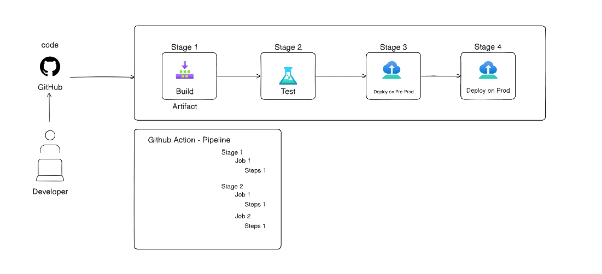

## Task 1: The Problem
Think about a team of 5 developers all pushing code to the same repo manually deploying to production.

Write in your notes:
```bash
1. What can go wrong?
# Merge Conflicts: Multiple developers pushing code simultaneously can lead to messy overlaps.
# Human Error: Forgetting a configuration step or running the wrong command during manual deployment.
# Inconsistency: One developer might deploy version A while another unknowingly overwrites it with version B.
# Downtime: Manual steps are slow, increasing the window where the site might be broken.

2. What does "It works on my machine" mean?

# This refers to a situation where code runs perfectly on a developer's local computer but fails in production. Why it's a problem:

# Environment Mismatch: Differences in OS, database versions, or installed libraries.
# Missing Dependencies: Local setups often have "hidden" tools or configs that aren't present on the server.
# Configuration Drift: Manual changes made directly to a server that aren't reflected in the local code.

3. How many times a day can a team safely deploy manually?

# Realistically, maybe 1 or 2 times, and even then it's high risk. Manual deployment is stressful and requires the whole team to "freeze" code, making frequent updates nearly impossible without automation.
```
---
## Task 2: CI vs CD
```bash
1. Continuous Integration (CI)
# Definition: Developers merge their code changes into a central repository several times a day. Each merge triggers an automated build and test sequence to ensure the new code doesn't break the existing application.

# What it catches: Integration bugs, syntax errors, and broken unit tests.

# Real-world Example: A developer pushes a bug fix to GitHub; an automated tool like Jenkins immediately runs unit tests. If a test fails, the developer gets an email to fix it before the code can be merged.


2. Continuous Delivery (CD)
# Definition: This is the extension of CI where the code is always in a "ready-to-deploy" state. It involves automated testing and environment syncing, but the final push to production requires a manual human trigger.

# What "Delivery" means: It means the software is technically ready to be released to users at any moment.

# Real-world Example: After passing all tests, the new version of an app is automatically pushed to a "Staging" environment. The Product Manager then clicks a "Deploy to Production" button on Friday morning to go live.

3. Continuous Deployment (CD)
# Definition: This takes automation a step further by removing the manual trigger. Every change that passes the automated testing pipeline is automatically deployed to the live production environment without human intervention.

# How it differs: Unlike Continuous Delivery, there is no manual "Approve" button. It is used by high-performing teams with very high test confidence.

# Real-world Example: A company like Netflix or Spotify pushes a small UI change. It passes all automated tests and, within minutes, the change is live for millions of users without anyone needing to "approve" the release.

```
Term | Automation Level | Human Interaction |
--- | --- | --- |
CI | Build & Test | Manual Code Review/Merge
Continuous Delivery | Ready for Prod | Manual Click to Deploy
Continuous Deployment | Fully Automated | Zero (Auto-Deploy to Prod)

---

## Task 3: Pipeline Anatomy
```bash
Trigger — what starts the pipeline
# The event that tells the pipeline to wake up and start running.

# What it does: It watches for specific actions like a git push, a Pull Request being opened, or even a scheduled time (like a nightly build).

# Example: You push code to the main branch, and GitHub Actions immediately starts the workflow. 

Stage — a logical phase (build, test, deploy)
# A high-level logical grouping of tasks in the pipeline.

# What it does: It organizes the workflow into major milestones like Build, Test, and Deploy. Stages usually run sequentially; if the "Test" stage fails, the "Deploy" stage won't start.

# Example: The "Test" stage contains all the different types of testing (unit, integration, linting).

Job — a unit of work inside a stage
# A set of steps that run on the same runner.

# What it does: Within a stage, you might have multiple jobs running at the same time (parallel) to save time. For instance, testing on Windows and testing on Linux can be two separate jobs in the same stage.

# Example: A job named run-unit-tests.

Step — a single command or action inside a job
# An individual task or command executed inside a job.

# What it does: This is the smallest unit of execution. It could be running a shell command, a script, or a pre-defined action.

# Example: npm install or docker build.

Runner — the machine that executes the job
# The actual machine (VM, container, or bare metal) where the code is executed.

# What it does: It provides the CPU, RAM, and OS environment needed to run your jobs. It "picks up" the job from the pipeline queue and executes the steps.

# Example: GitHub-hosted runners or a private Jenkins agent.


Artifact — output produced by a job

# The physical file or output produced by a job that needs to be saved.

# What it does: Pipelines are temporary; once a runner finishes, the files are deleted. Artifacts allow you to "save" the output (like a .zip file, a .jar, or a compiled binary) to use in a later stage or for production.

# Example: A compiled index.html file or a Docker image.

```
```bash
Visual Summary

# Pipeline → The entire factory.

# Stage → The department (e.g., Quality Control).

# Job → The workstation.

# Step → The specific instruction (e.g., "Tighten this bolt").

# Runner → The worker at the station.

# Artifact → The finished product in a box.
```
---
#### Task 4: Draw a Pipeline

Draw a CI/CD pipeline for this scenario:

> A developer pushes code to GitHub. The app is tested, built into a Docker image, and deployed to a staging server.



---

#### Task 5: Explore in the Wild

1. Open any popular open-source repo on GitHub (Kubernetes, React, FastAPI — pick one you know)
2. Find their .github/workflows/ folder
3. Open one workflow YAML file
4. Write in your notes:
    - What triggers it?
        ```bash
        on:
          workflow_dispatch:
          push:
            branches:
              - master

        ```
    - How many jobs does it have?
        ```bash
        - build_minikube
        - lint
        - unit_test

        # I see 3 jobs.        
        ```
    - What does it do? (best guess)
        ```bash
        # its build lint and test.        
        ```
---