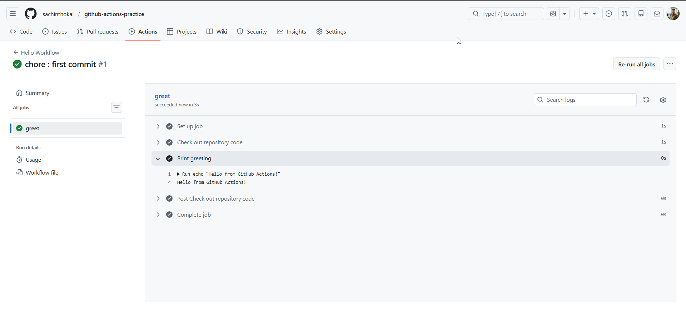
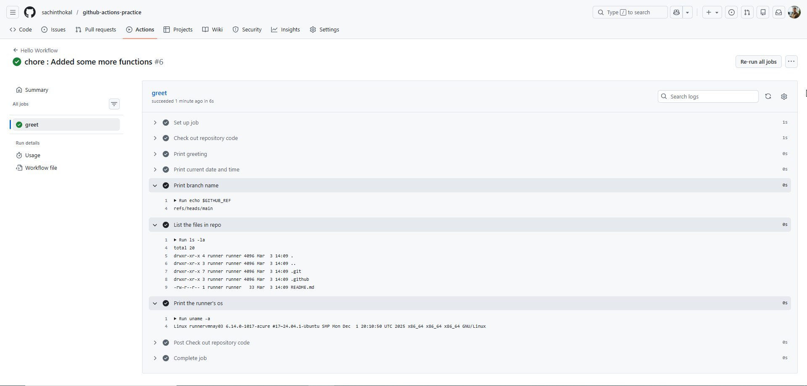
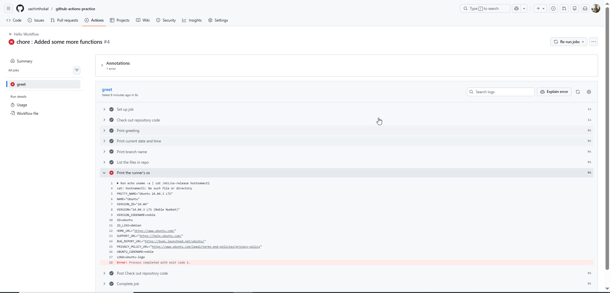

#### Task 1: Set Up & Task 2: Hello Workflow

```yml

name: Hello Workflow

# The TRIGGER: What starts the pipeline?
on: [push]

jobs:
  # The JOB: A unit of work
  greet:
    # The RUNNER: The machine executing the job
    runs-on: ubuntu-latest

    steps:
      # STEP 1: Using a pre-made action to copy your repo files to the machine
      - name: Check out repository code
        uses: actions/checkout@v4

      # STEP 2: A standard shell command
      - name: Print greeting
        run: echo "Hello from GitHub Actions!"

```


---
#### Task 3: Understand the Anatomy
```bash
1. on: (The Trigger)
# Defines the specific event that starts the workflow execution.
# For example, "on: [push]" triggers the pipeline whenever code is pushed.

2. jobs: (The Container)
# Groups related tasks together into a single unit of work.
# A workflow can have multiple jobs (e.g., build, test) running in parallel.

3. runs-on: (The Machine)
# Specifies the operating system (Runner) where the job will execute.
# Using "ubuntu-latest" provides a fresh Linux virtual machine for your code.

4. steps: (The Instructions)
# A sequence of tasks that are executed in order inside a specific job.
# If one step fails, the subsequent steps in that job are usually skipped.

5. uses: (The Tool)
# Tells the runner to use a pre-built Action created by GitHub or the community.
# "actions/checkout" is used to clone your repository code onto the runner.

6. run: (The Command)
# Executes custom shell commands directly on the runner's terminal.
# It is used for running scripts, installing packages, or printing logs.

7. name: (The Label)
# A friendly title displayed on the GitHub Actions dashboard for easy tracking.
# It helps you identify exactly which part of the process is running or failed.

```
#### Task 4: Add More Steps


#### Task 5: Break It On Purpose



Final Working YML File
```yml
name: Hello Workflow

# The TRIGGER: What starts the pipeline?
on: [push]

jobs:
  # The JOB: A unit of work
  greet:
    # The RUNNER: The machine executing the job
    runs-on: ubuntu-latest

    steps:
      # STEP 1: Using a pre-made action to copy your repo files to the machine
      - name: Check out repository code
        uses: actions/checkout@v4

      # STEP 2: A standard shell command
      - name: Print greeting
        run: echo "Hello from GitHub Actions!"
      
      # STEP 3: Print current date and time
      - name: Print current date and time
        run: date
      
      # STEP 4: Print name of the branch
      - name: Print branch name
        run: echo $GITHUB_REF
      
      # STEP 5: List the files in the repo
      - name: List the files in repo
        run: ls -la

      # STEP 6: Print the runner's os
      - name: Print the runner's os
        run: uname -a
```

---
