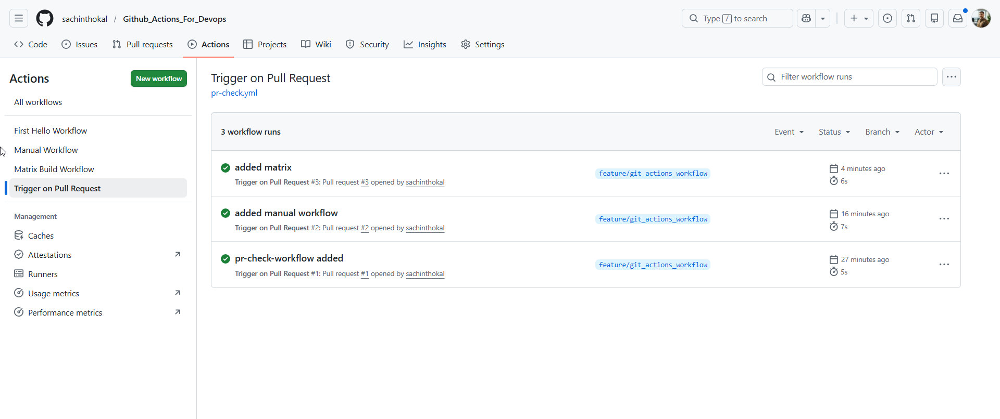
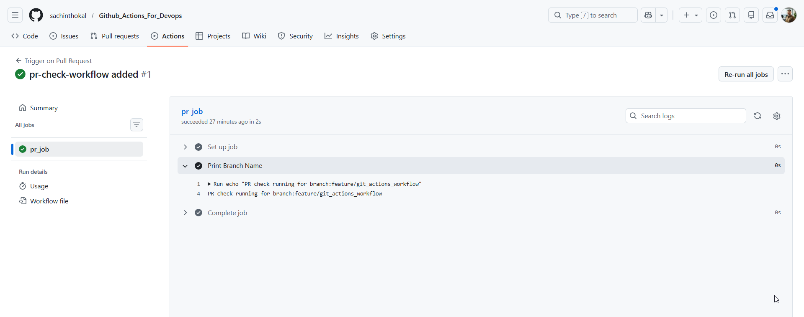
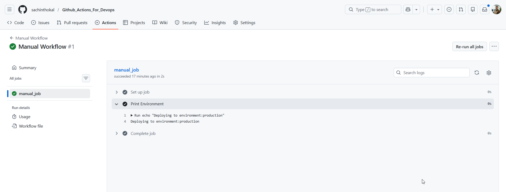
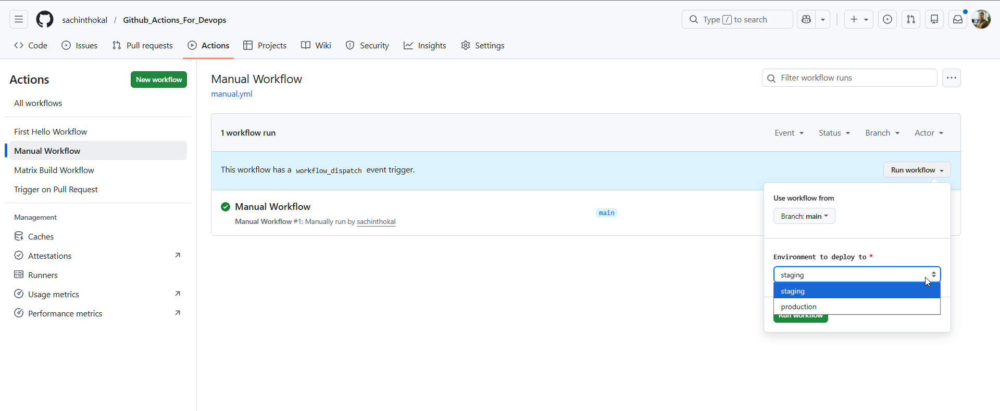
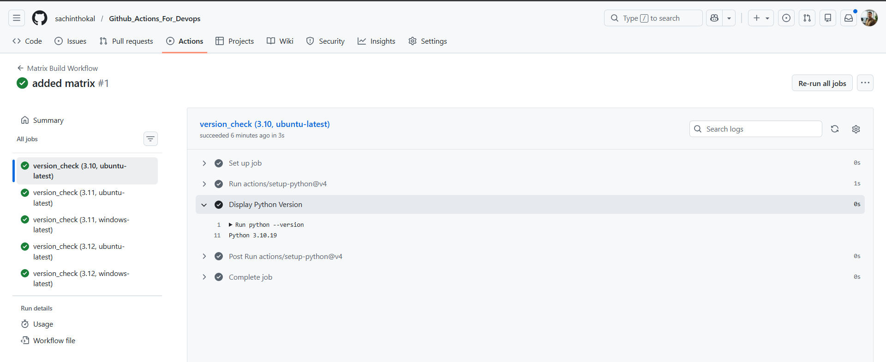

```bash
# pr_check.yml
name: Trigger on Pull Request

on:
  pull_request:
    branches: [ main ]
    types: [ opened, synchronize ]
  schedule:
    - cron: '0 0 * * *'

jobs:
  pr_job:
    runs-on: ubuntu-latest
    steps:
      - name: Print Branch Name
        run: echo "PR check running for branch:${{ github.head_ref }}"


# manual.yml
name: Manual Workflow
on:
  workflow_dispatch:
    inputs:
      environment:
        description: 'Environment to deploy to'
        required: true
        default: 'staging'
        type: choice
        options:
          - staging
          - production

jobs:
  manual_job:
    runs-on: ubuntu-latest
    steps:
      - name: Print Environment
        run: echo "Deploying to environment:${{ github.event.inputs.environment }}"


# matrix.yml
name: Matrix Build Workflow

on: push

jobs:
  version_check:
    strategy:
      fail-fast: false
      matrix:
        python-version: ["3.10", "3.11", "3.12"]
        os: [ubuntu-latest, windows-latest]
        exclude:
          - os: windows-latest
            python-version: "3.10"

    runs-on: ${{ matrix.os }}
    steps:
      - uses: actions/setup-python@v4
        with:
          python-version: ${{ matrix.python-version }}
      - name: Display Python Version
        run: python --version

```
---




