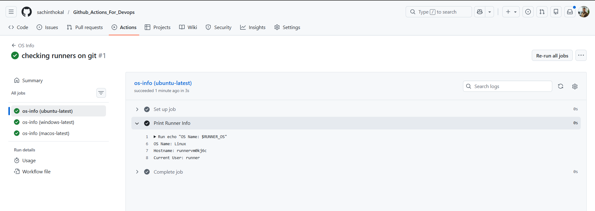
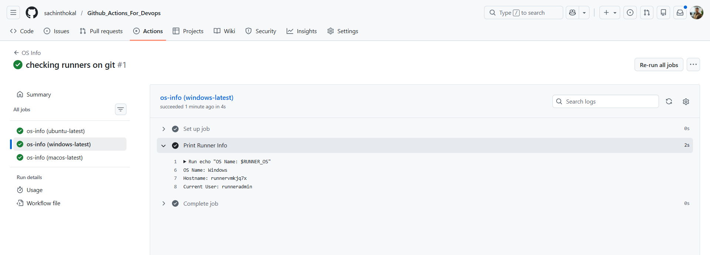
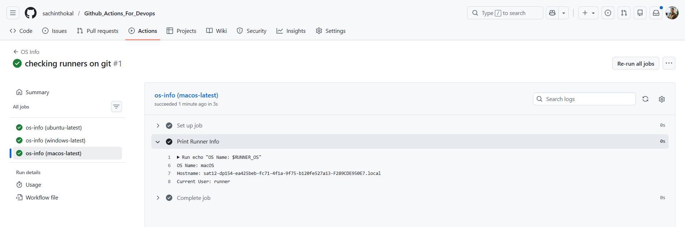
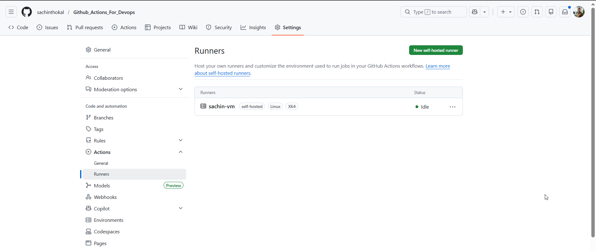
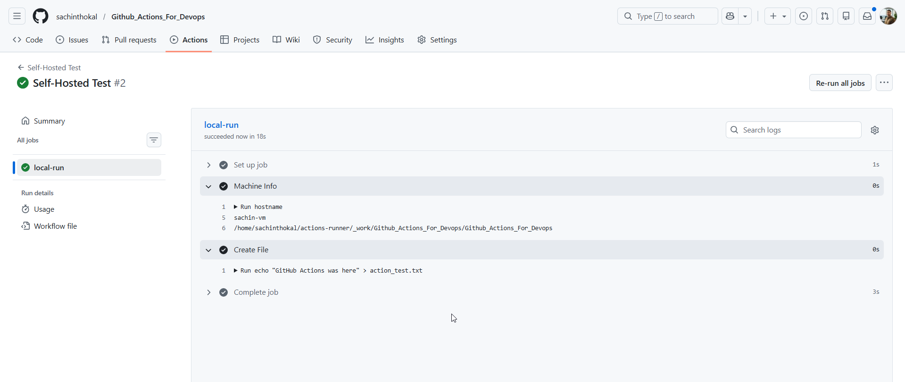
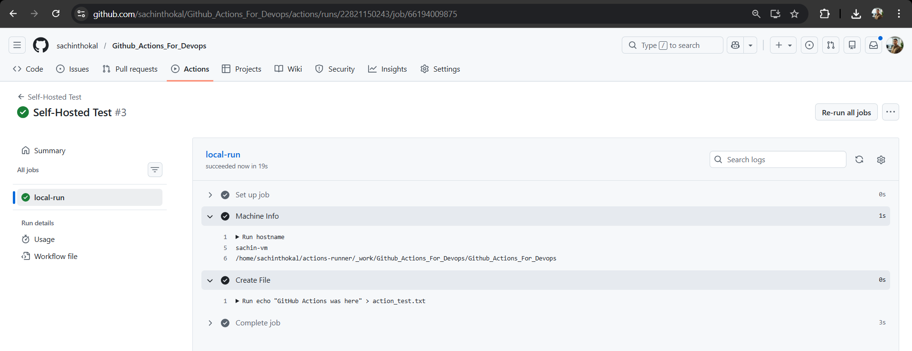
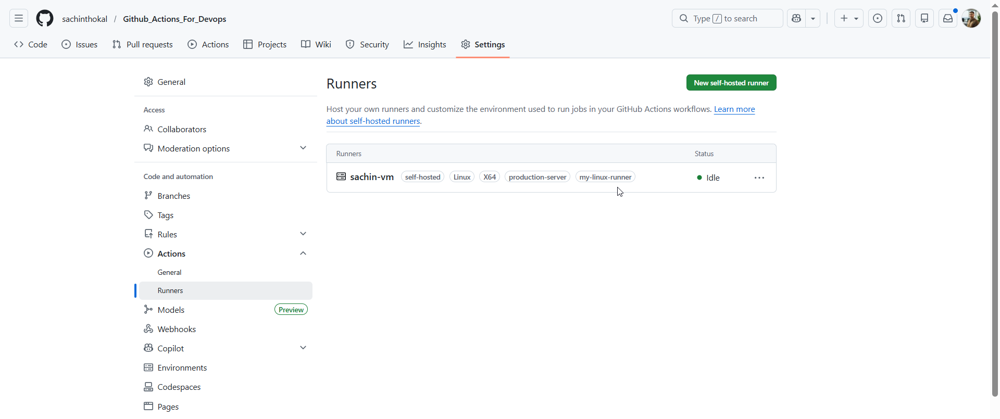

#### Task 1: GitHub-Hosted Runners
```yml
name: OS Info
on: push

jobs:
  os-info:
    strategy:
      matrix:
        os: [ubuntu-latest, windows-latest, macos-latest]
    runs-on: ${{ matrix.os }}
    steps:
      - name: Print Runner Info
        shell: bash
        run: |
          echo "OS Name: $RUNNER_OS"
          echo "Hostname: $(hostname)"
          echo "Current User: $(whoami)"
```


#### Task 2: Explore What's Pre-installed
```yml
name: OS Info
on: push

jobs:
  os-info:
    strategy:
      matrix:
        os: [ubuntu-latest, windows-latest, macos-latest]
    runs-on: ${{ matrix.os }}
    steps:
      - name: Print Runner Info
        shell: bash
        run: |
          echo "OS Name: $RUNNER_OS"
          echo "Hostname: $(hostname)"
          echo "Current User: $(whoami)"
          
      - name: Check Pre-installed Tools
        run: |
          docker --version
          python3 --version
          node --version
          git --version
```


---

#### Task 3: Set Up a Self-Hosted Runner


#### Task 4: Use Your Self-Hosted Runner


#### Task 5: Labels
```yml
name: Self-Hosted Test
on: workflow_dispatch

jobs:
  local-run:
    runs-on: [self-hosted, my-linux-runner]
    steps:
      - name: Machine Info
        run: |
          hostname
          pwd
      - name: Create File
        run: echo "GitHub Actions was here" > action_test.txt
```


---

#### Task 6: GitHub-Hosted vs Self-Hosted
| | GitHub-Hosted | Self-Hosted |
|---|---|---| 
| Who manages it? | Github manages it| Self manages |
| Cost | Github runner take charges | Free to use|
| Pre-installed tools | Yes [Git, Python, Node, Docker] | You must install everything |
| Good for | Standard builds, quick setups, and public projects. | Specialized hardware |
| Security concern | Low | High |
---
---