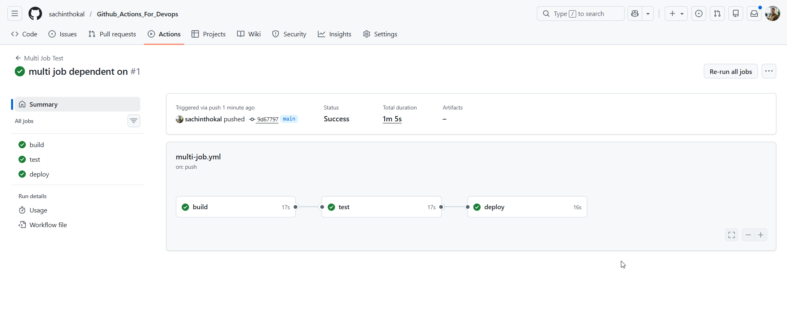
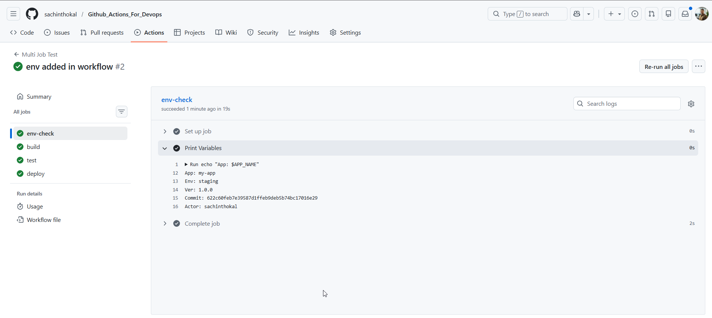
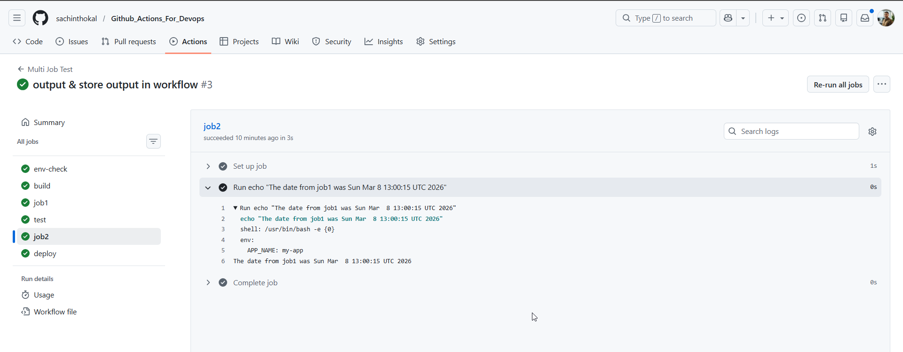
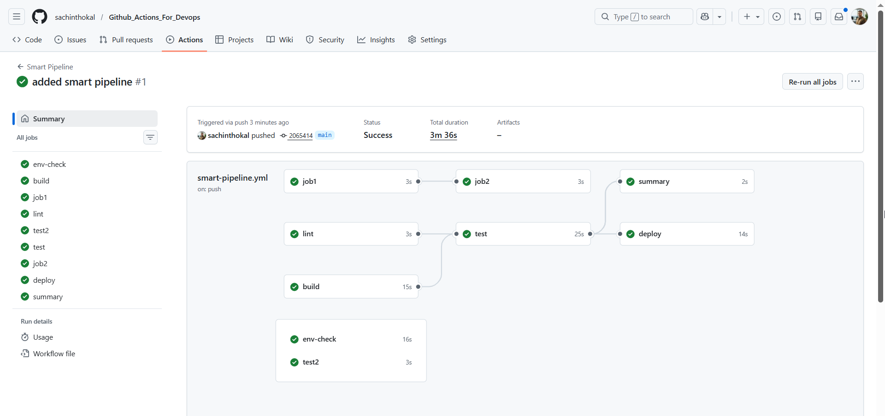

#### Task 1: Multi-Job Workflow

```yml
name: Multi Job Test
on: [push]
jobs:
  build:
    runs-on: self-hosted
    steps:
      - name: Print Job name
        run: echo "Building the application"
  test:
    needs: build
    runs-on: self-hosted
    steps:
        - name: Print Job name
          run: echo "Running tests"
  deploy:
    needs: test
    runs-on: self-hosted
    steps:
        - name: Print Job name
          run: echo "Deploying the application"
```


#### Task 2: Environment Variables

```yml
name: Multi Job Test
on: [push]
env:
  APP_NAME: my-app

jobs:
  env-check:
    runs-on: self-hosted
    env:
      ENVIRONMENT: staging
    steps:
      - name: Print Variables
        env:
          VERSION: 1.0.0
        run: |
          echo "App: $APP_NAME"
          echo "Env: $ENVIRONMENT"
          echo "Ver: $VERSION"
          echo "Commit: ${{ github.sha }}"
          echo "Actor: ${{ github.actor }}"

  build:
    runs-on: self-hosted
    steps:
      - name: Print Job name
        run: echo "Building the application"
  test:
    needs: build
    runs-on: self-hosted
    steps:
        - name: Print Job name
          run: echo "Running tests"
  deploy:
    needs: test
    runs-on: self-hosted
    steps:
        - name: Print Job name
          run: echo "Deploying the application"
```

---
```yml
name: Multi Job Test
on: [push]
env:
  APP_NAME: my-app

jobs:
  env-check:
    runs-on: self-hosted
    env:
      ENVIRONMENT: staging
    steps:
      - name: Print Variables
        env:
          VERSION: 1.0.0
        run: |
          echo "App: $APP_NAME"
          echo "Env: $ENVIRONMENT"
          echo "Ver: $VERSION"
          echo "Commit: ${{ github.sha }}"
          echo "Actor: ${{ github.actor }}"
  build:
    runs-on: self-hosted
    steps:
      - name: Print Job name
        run: echo "Building the application"
  test:
    needs: build
    runs-on: self-hosted
    steps:
        - name: Print Job name
          run: echo "Running tests"
  deploy:
    needs: test
    runs-on: self-hosted
    steps:
        - name: Print Job name
          run: echo "Deploying the application"
  job1:
    runs-on: ubuntu-latest
    outputs:
      build_date: ${{ steps.get_date.outputs.date }}
    steps:
      - id: get_date
        run: echo "date=$(date)" >> $GITHUB_OUTPUT

  job2:
    needs: job1
    runs-on: ubuntu-latest
    steps:
      - run: echo "The date from job1 was ${{ needs.job1.outputs.build_date }}"
```


---
```yml
name: Smart Pipeline
on: [push]
env:
  APP_NAME: my-app

jobs:
  env-check:
    runs-on: self-hosted
    env:
      ENVIRONMENT: staging
    steps:
      - name: Print Variables
        env:
          VERSION: 1.0.0
        run: |
          echo "App: $APP_NAME"
          echo "Env: $ENVIRONMENT"
          echo "Ver: $VERSION"
          echo "Commit: ${{ github.sha }}"
          echo "Actor: ${{ github.actor }}"
  build:
    runs-on: self-hosted
    steps:
      - name: Print Job name
        run: echo "Building the application"
  test:
    needs: build
    runs-on: self-hosted
    steps:
        - name: Print Job name
          run: echo "Running tests"
  deploy:
    needs: test
    runs-on: self-hosted
    steps:
        - name: Print Job name
          run: echo "Deploying the application"
  job1:
    runs-on: ubuntu-latest
    outputs:
      build_date: ${{ steps.get_date.outputs.date }}
    steps:
      - id: get_date
        run: echo "date=$(date)" >> $GITHUB_OUTPUT

  job2:
    needs: job1
    runs-on: ubuntu-latest
    steps:
      - run: echo "The date from job1 was ${{ needs.job1.outputs.build_date }}"
    
      - name: Only on Main
        if: github.ref == 'refs/heads/main'
        run: echo "Deploying to production..."

      - name: Critical Step
        id: critical
        continue-on-error: true # Job continues even if this fails
        run: exit 1

      - name: Fallback
        if: failure() && steps.critical.outcome == 'failure'
        run: echo "The critical step failed, but I am handling it."

  lint:
    runs-on: ubuntu-latest
    steps:
      - run: echo "Linting code..."

  test2:
    runs-on: ubuntu-latest
    steps:
      - run: echo "Testing code..."

  summary:
    needs: [lint, test]
    runs-on: ubuntu-latest
    steps:
      - name: Report
        run: |
          echo "Branch: ${{ github.ref_name }}"
          echo "Message: ${{ github.event.head_commit.message }}"
          if [ "${{ github.ref_name }}" == "main" ]; then
            echo "Status: This is a Production push."
          else
            echo "Status: This is a Feature branch push."
          fi
```


---