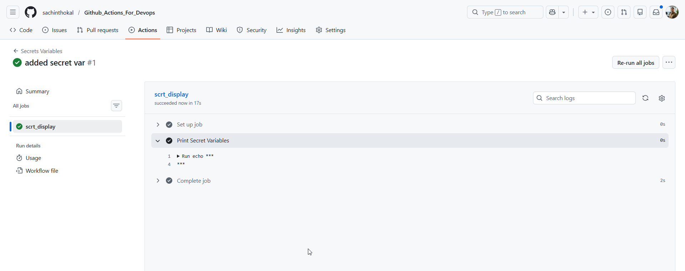
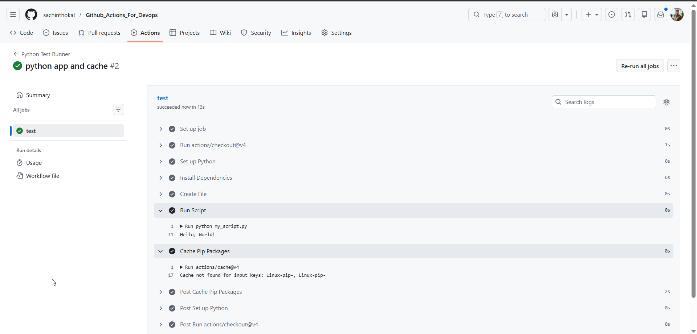

#### Task 1: GitHub Secrets
```yml

name: Secrets Variables

on: push

jobs:
  scrt_display:
    runs-on: self-hosted
    steps:
      - name: Print Secret Variables
        run: echo ${{ secrets.MY_SECRET_MESSAGE }}

```

---
```yml
name: Python Test Runner
on: push

jobs:
  test:
    runs-on: ubuntu-latest
    steps:
      - uses: actions/checkout@v4
      - name: Set up Python
        uses: actions/setup-python@v5
        with:
          python-version: '3.11'
      - name: Install Dependencies
        run: pip install pytest  # or whatever your script needs
      - name: Create File
        run: echo "print('Hello, World!')" > my_script.py

      - name: Run Script
        run: python my_script.py
      
      - name: Cache Pip Packages
        uses: actions/cache@v4
        with:
          path: ~/.cache/pip
          key: ${{ runner.os }}-pip-${{ hashFiles('**/requirements.txt') }}
          restore-keys: |
            ${{ runner.os }}-pip-

```

--- 