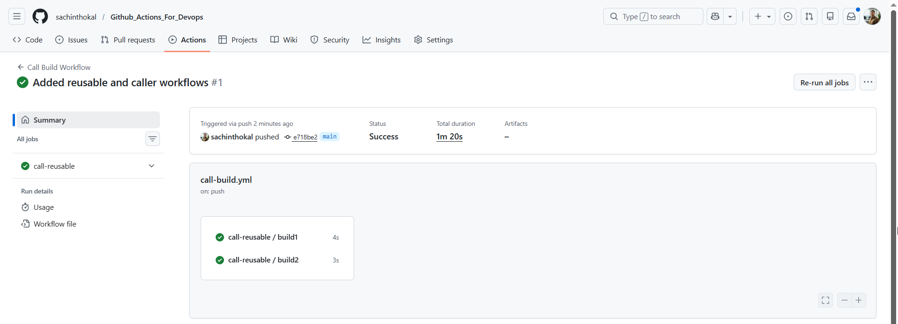

## Task 1:

1. What is a reusable workflow?
```bash
# A reusable workflow is a YAML file that can be called by other workflows. It allows you to centralize CI/CD logic to avoid duplication.

```
2. What is the workflow_call trigger?
```bash
# It is the specific trigger required in the on: section of a workflow to make it "callable" by other workflows.
```
3. How is calling a reusable workflow different from using a regular action (uses:)?
```bash
# Action: Runs a specific task/step within a job.

    # Reusable Workflow: Runs an entire job (or multiple jobs) including the runner environment.
```
4. Where must a reusable workflow file live?
```bash
# .github/workflows/ directory of a repository.
```
## Task 2: Create Reusable Workflow
```yml
name: Reusable Build Workflow

on:
  workflow_call:
    inputs:
      app_name:
        required: true
        type: string
      environment:
        required: true
        type: string
        default: 'staging'
    secrets:
      docker_token:
        required: true
    outputs:
      build_version:
        description: "The generated build version"
        value: ${{ jobs.build.outputs.version }}

jobs:
  build1:
    runs-on: ubuntu-latest
    steps:
      - uses: actions/checkout@v4
      - name: Print Info
        run: |
          echo "Building ${{ inputs.app_name }} for ${{ inputs.environment }}"
          if [ -n "${{ secrets.docker_token }}" ]; then
            echo "Docker token is set: true"
          fi
  build2:
    runs-on: ubuntu-latest
    outputs:
      version: ${{ steps.gen-version.outputs.v }}
    steps:
      - id: gen-version
        run: echo "v=v1.0-${GITHUB_SHA::7}" >> $GITHUB_OUTPUT
```
## Task 3: Create a Caller Workflow
```yml
name: Call Build Workflow

on:
  push:
    branches: [ main ]

jobs:
  call-reusable:
    uses: ./.github/workflows/reusable-build.yml
    with:
      app_name: "my-web-app"
      environment: "production"
    secrets:
      docker_token: ${{ secrets.DOCKER_TOKEN }}
```
## Task 5: Create a Composite Action
```yml
name: 'Setup and Greet'
description: 'Greets the user and shows system info'
inputs:
  name:
    description: 'The name to greet'
    required: true
  language:
    description: 'The language for the greeting'
    default: 'en'
outputs:
  greeted:
    description: 'Confirmation that greeting was displayed'
    value: 'true'

runs:
  using: "composite"
  steps:
    - run: echo "Hello ${{ inputs.name }} in ${{ inputs.language }}!"
      shell: bash
    - run: |
        date
        echo "Running on ${{ runner.os }}"
      shell: bash
```
## Task 6: Reusable Workflow vs Composite Action

| Feature | Reusable Workflow | Composite Action |
| :--- | :--- | :--- |
| **Triggered by** | `workflow_call` | `uses:` in a workflow step |
| **Can contain jobs?** | **Yes** (Full job structure) | **No** (Only a list of steps) |
| **Can contain multiple steps?** | **Yes** | **Yes** |
| **Lives where?** | `.github/workflows/` | Any folder (e.g., `.github/actions/`) |
| **Can accept secrets directly?** | **Yes** (Using the `secrets:` keyword) | **No** (Must be passed as `inputs`) |
| **Best for?** | Standardizing entire CI/CD pipelines | Grouping common shell commands/scripts |

