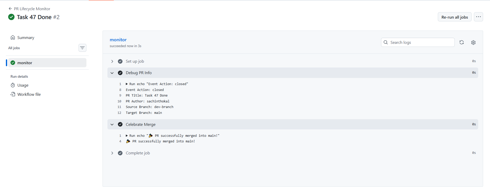
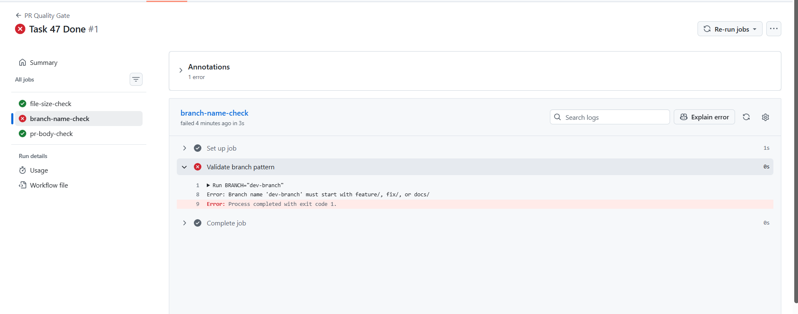
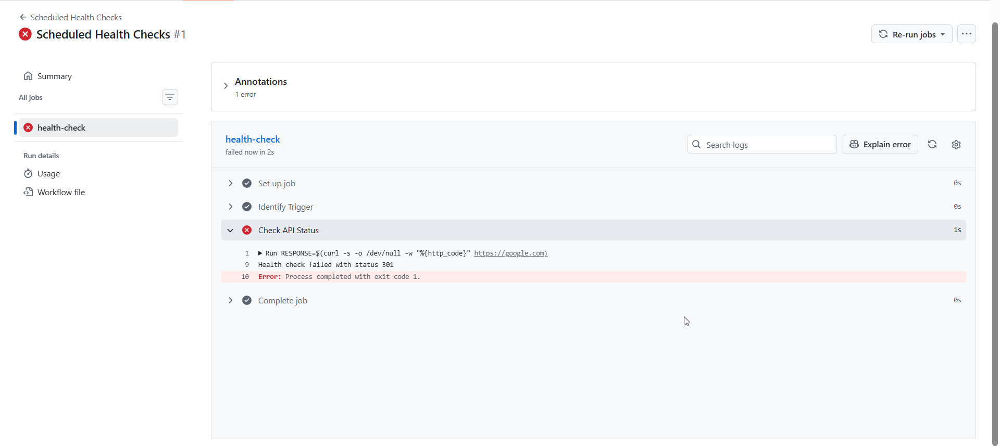
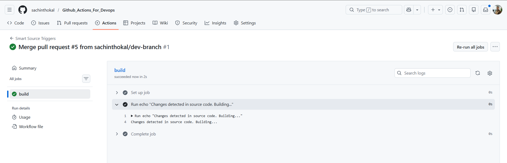
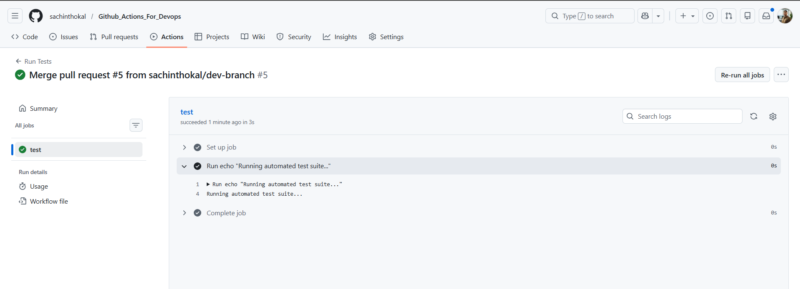
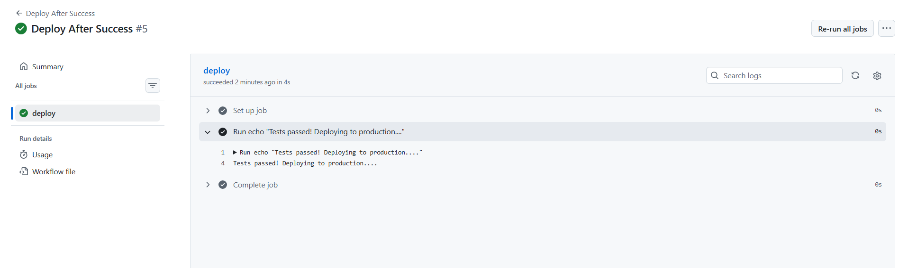

## Task 47

```yml
# pr-lifecycle.yml
name: PR Lifecycle Monitor
on:
  pull_request:
    types: [opened, synchronize, reopened, closed]

jobs:
  monitor:
    runs-on: ubuntu-latest
    steps:
      - name: Debug PR Info
        run: |
          echo "Event Action: ${{ github.event.action }}"
          echo "PR Title: ${{ github.event.pull_request.title }}"
          echo "PR Author: ${{ github.event.pull_request.user.login }}"
          echo "Source Branch: ${{ github.head_ref }}"
          echo "Target Branch: ${{ github.base_ref }}"

      - name: Celebrate Merge
        if: github.event.pull_request.merged == true
        run: echo "🎉 PR successfully merged into ${{ github.base_ref }}!"


# pr-checks.yml

name: PR Quality Gate
on:
  pull_request:
    branches: [main]

jobs:
  file-size-check:
    runs-on: ubuntu-latest
    steps:
      - uses: actions/checkout@v4
      - name: Check for large files
        run: |
          find . -type f -size +1M | grep . && exit 1 || echo "All files under 1MB"

  branch-name-check:
    runs-on: ubuntu-latest
    steps:
      - name: Validate branch pattern
        run: |
          BRANCH="${{ github.head_ref }}"
          if [[ ! $BRANCH =~ ^(feature/|fix/|docs/) ]]; then
            echo "Error: Branch name '$BRANCH' must start with feature/, fix/, or docs/"
            exit 1
          fi

  pr-body-check:
    runs-on: ubuntu-latest
    steps:
      - name: Check description
        run: |
          BODY="${{ github.event.pull_request.body }}"
          if [ -z "$BODY" ]; then
            echo "::warning ::The PR description is empty. Please provide context."
          fi

# scheduled-tasks.yml

name: Scheduled Health Checks
on:
  schedule:
    - cron: '30 2 * * 1'   # Mondays at 2:30 AM UTC
    - cron: '0 */6 * * *'  # Every 6 hours
  workflow_dispatch:      # Manual trigger for testing

jobs:
  health-check:
    runs-on: ubuntu-latest
    steps:
      - name: Identify Trigger
        run: echo "Triggered by schedule: ${{ github.event.schedule }}"
      
      - name: Check API Status
        run: |
          RESPONSE=$(curl -s -o /dev/null -w "%{http_code}" https://google.com)
          if [ "$RESPONSE" -ne 200 ]; then
            echo "Health check failed with status $RESPONSE"
            exit 1
          fi
          echo "Status is OK: $RESPONSE"


# smart-triggers.yml
name: Smart Source Triggers
on:
  push:
    branches: [main, 'release/*']
    paths:
      - 'src/**'
      - 'app/**'
    paths-ignore:
      - '*.md'
      - 'docs/**'

jobs:
  build:
    runs-on: ubuntu-latest
    steps:
      - run: echo "Changes detected in source code. Building..."


# tests.yml

name: Run Tests
on: [push]
jobs:
  test:
    runs-on: ubuntu-latest
    steps:
      - run: echo "Running automated test suite..."

# deploy-after-tests.yml
name: Deploy After Success
on:
  workflow_run:
    workflows: ["Run Tests"]
    types: [completed]

jobs:
  deploy:
    runs-on: ubuntu-latest
    if: ${{ github.event.workflow_run.conclusion == 'success' }}
    steps:
      - run: echo "Tests passed! Deploying to production..."

```





