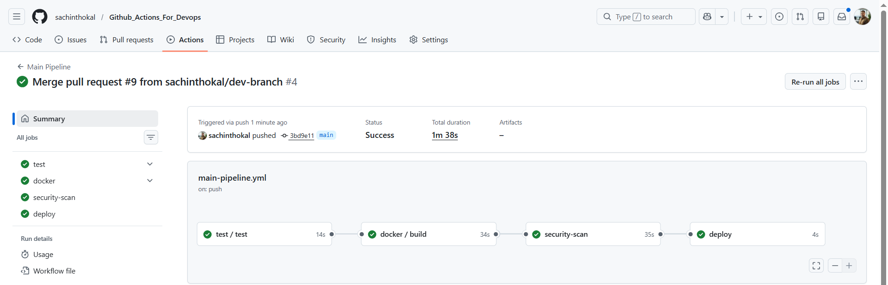
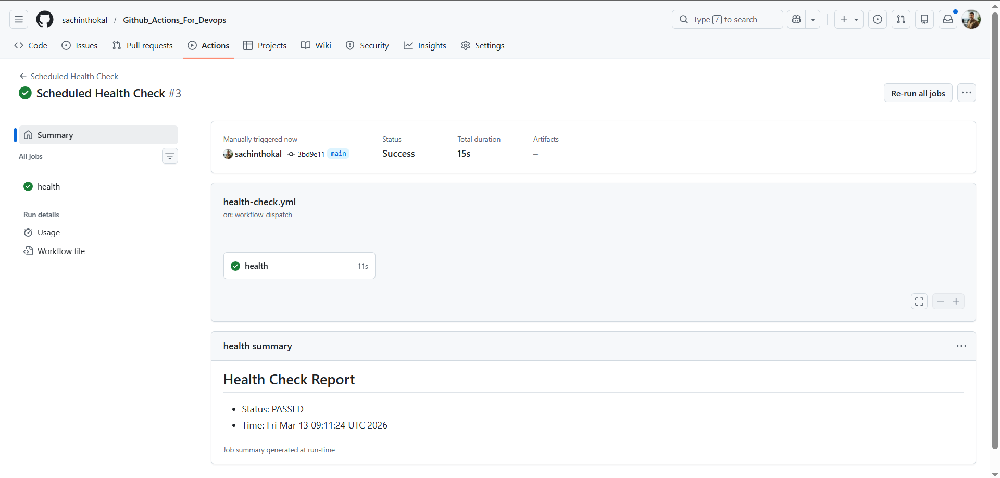

### Task 48

```yml
# Main Pipeline

name: Main Pipeline
on:
  push:
    branches: [ main ]

jobs:
  test:
    uses: ./.github/workflows/reusable-build-test.yml

  docker:
    needs: test
    uses: ./.github/workflows/reusable-docker.yml
    with:
      image_name: ${{ vars.DOCKER_USERNAME }}/fastapi-capstone
      tag: sha-${{ github.sha }}
    secrets:
      docker_username: ${{ secrets.DOCKER_USERNAME }}
      docker_token: ${{ secrets.DOCKER_TOKEN }}

  security-scan:
    needs: docker
    runs-on: ubuntu-latest
    steps:
      - name: Run Trivy vulnerability scanner on
        uses: aquasecurity/trivy-action@master
        with:
          image-ref: '${{ vars.DOCKER_USERNAME }}/fastapi-capstone:latest'
          format: 'table'
          exit-code: '1'
          severity: 'CRITICAL'

  deploy:
    needs: [docker, security-scan]
    runs-on: ubuntu-latest
    environment: production
    steps:
      - name: Deploy
        run: echo "Deploying image ${{ needs.docker.outputs.image_url }} to Production"

# reusable-build-test.yml

name: Reusable Build & Test
on:
  workflow_call:
    inputs:
      python_version:
        type: string
        default: '3.10'
      run_tests:
        type: boolean
        default: true
    outputs:
      test_result:
        value: ${{ jobs.test.outputs.status }}

jobs:
  test:
    runs-on: ubuntu-latest
    outputs:
      status: ${{ steps.set-status.outputs.status }}
    steps:
      - uses: actions/checkout@v4
      - uses: actions/setup-python@v5
        with:
          python_version: ${{ inputs.python_version }}
      - name: Install dependencies
        run: pip install -r requirements.txt
      - name: Run Pytest
        if: ${{ inputs.run_tests }}
        run: pytest
      - id: set-status
        run: echo "status=passed" >> $GITHUB_OUTPUT


# reusable-docker.yml

name: Reusable Docker
on:
  workflow_call:
    inputs:
      image_name:
        required: true
        type: string
      tag:
        required: true
        type: string
    secrets:
      docker_username:
        required: true
      docker_token:
        required: true
    outputs:
      image_url:
        value: ${{ inputs.image_name }}:${{ inputs.tag }}

jobs:
  build:
    runs-on: ubuntu-latest
    steps:
      - uses: actions/checkout@v4
      - name: Login to Docker Hub
        uses: docker/login-action@v3
        with:
          username: ${{ secrets.DOCKER_USERNAME }}
          password: ${{ secrets.DOCKER_TOKEN }}
      - name: Build and Push
        uses: docker/build-push-action@v5
        with:
          push: true
          tags: |
            ${{ inputs.image_name }}:latest
            ${{ inputs.image_name }}:${{ inputs.tag }}

# Scheduled Health Check

name: Scheduled Health Check
on:
  schedule:
    - cron: '0 */12 * * *'
  workflow_dispatch:

jobs:
  health:
    runs-on: ubuntu-latest
    steps:
      - name: Run App
        run: |
          docker run -d -p 8000:8000 --name capstone-app ${{ vars.DOCKER_USERNAME }}/fastapi-capstone:latest
          sleep 5
      - name: Curl Check
        run: |
          if curl -s http://localhost:8000/health | grep "healthy"; then
            echo "STATUS=PASSED" >> $GITHUB_ENV
          else
            echo "STATUS=FAILED" >> $GITHUB_ENV
            exit 1
          fi
      - name: Summary
        if: always()
        run: |
          echo "## Health Check Report" >> $GITHUB_STEP_SUMMARY
          echo "- Status: ${{ env.STATUS }}" >> $GITHUB_STEP_SUMMARY
          echo "- Time: $(date)" >> $GITHUB_STEP_SUMMARY


```

