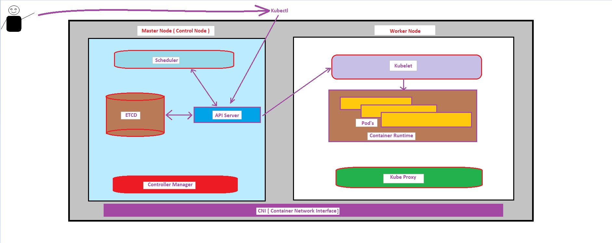
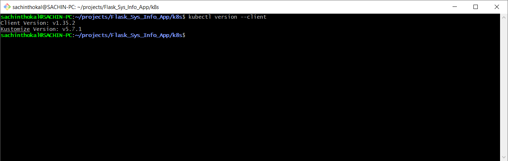
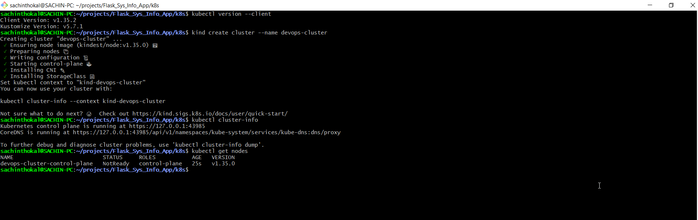
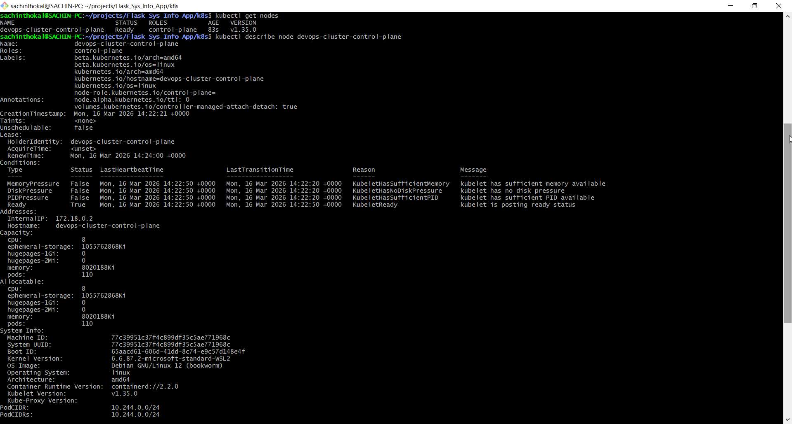
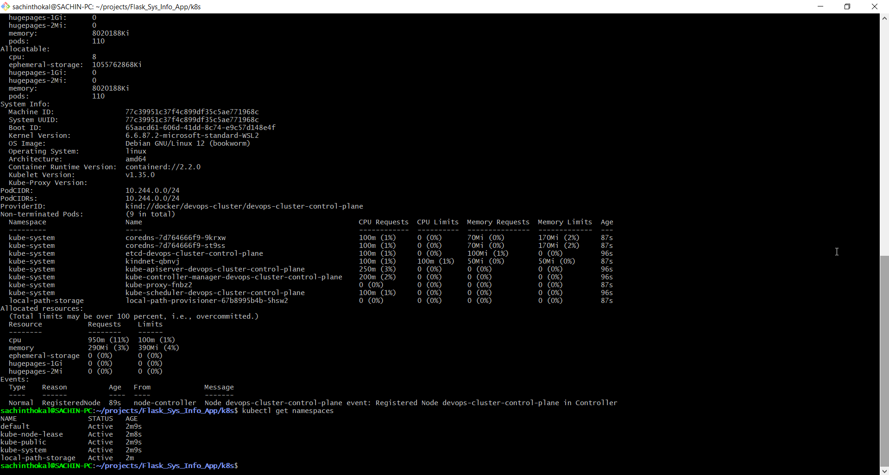
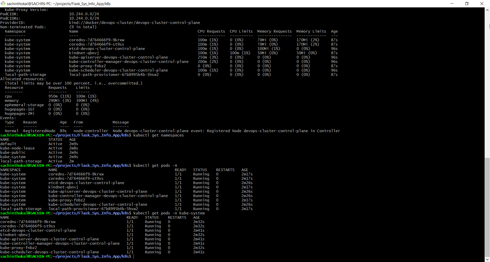
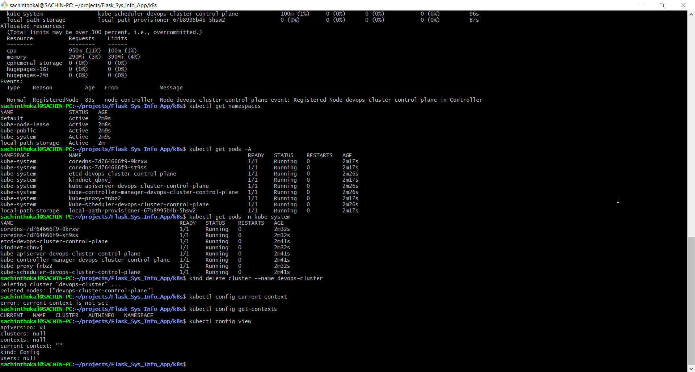

#### 1. Why was Kubernetes created?

Kubernetes (K8s) was designed to automate the manual processes involved in deploying, scaling, and operating containerized applications. While Docker provides the container runtime (the box), Kubernetes provides the orchestration (the conductor).

Problems Docker alone cannot solve efficiently.
> Self-Healing: If a Docker container crashes on a standalone host, it stays down unless manually restarted. Kubernetes monitors containers and automatically restarts or replaces them if they fail.

> Auto-Scaling: Docker doesn't natively scale your application up or down based on traffic. Kubernetes can spin up more replicas during a spike and terminate them when demand drops.

> Service Discovery & Load Balancing: Managing how containers talk to each other across different servers is complex in plain Docker. Kubernetes provides a stable IP and DNS name for a set of containers and balances traffic between them.

1. Who created it and what was it inspired by?

> Kubernetes was originally developed by Google. It was later donated to the Cloud Native Computing Foundation (CNCF).

1. What does the name "Kubernetes" mean?

> The name comes from the Greek word kybernetes, which means "helmsman" or "pilot" (the person who steers a ship). This fits the maritime theme of containers. The abbreviation K8s comes from replacing the eight letters between the "K" and the "s" with the number 8.

---

#### Task 2: Draw the Kubernetes Architecture

What happens when you run kubectl apply -f pod.yaml? Trace the request through each component.

#### Step by Step flow

Step 1 : User run below command

> kubectl apply -f pod.yaml

⬇

Step 2

> Request Goes to API Server

⬇

Step 3

> API Server save configuration in etcd

⬇

Step 4

> Scheduler decide : on where & which node will run this pod

⬇

Step 5

> On Selected node Scheduler give  instruction to kubelet.

⬇

Step 6

> kubelet call to Container Runtime : Lets start container

⬇

Step 7

Pod will run 🎉

---

What happens if the API server goes down?
>
> 1. If API Server goes down then kubectl cmd will not work after API server down.
> 2. Cluster state will not get modify.
> 3. Container will keep running because API server have independent.

What happens if a worker node goes down?
>
> Controller Manager will detect the node.
> Controller recreate all unavailable pods on another healthy node

---

#### Task 4: Set Up Your Local Cluster

#### Task 5: Explore Your Cluster

