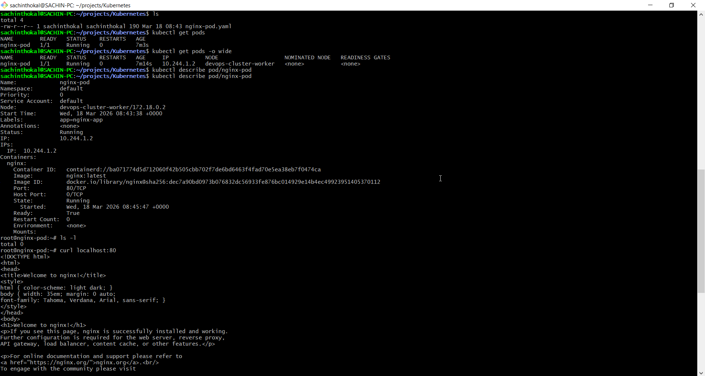
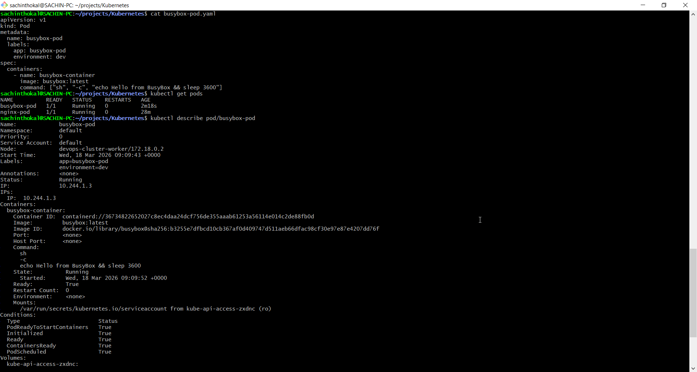
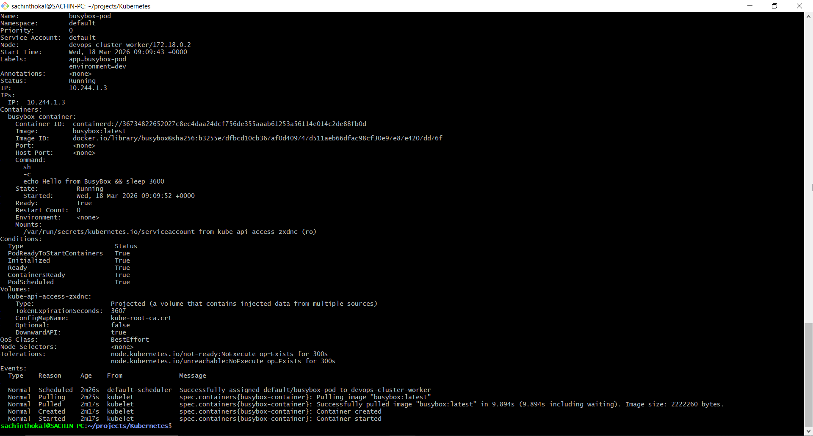
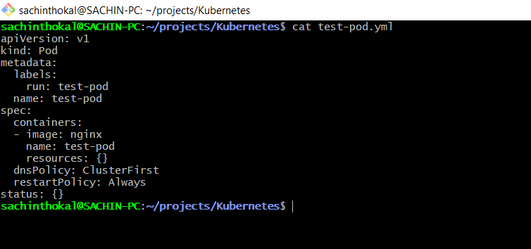
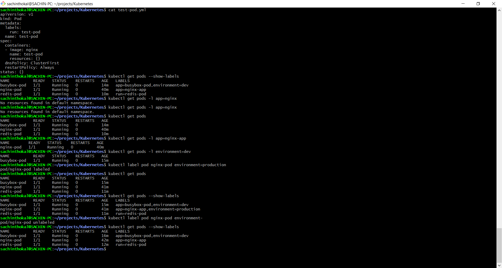
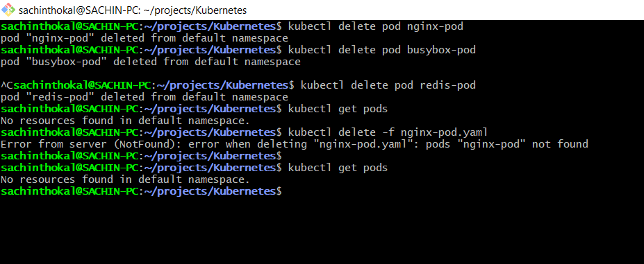

## Task 1: Create Your First Pod (Nginx)

```yml
# nginx-pod.yaml

apiVersion: v1
kind: Pod
metadata:
  name: nginx-pod
  labels:
    app: nginx
spec:
  containers:
  - name: nginx
    image: nginx:latest
    ports:
    - containerPort: 80

```



---

## Task 2: Create a Custom Pod (BusyBox)

```yml
apiVersion: v1
kind: Pod
metadata:
  name: busybox-pod
  labels:
    app: busybox
    environment: dev
spec:
  containers:
  - name: busybox
    image: busybox:latest
    command: ["sh", "-c", "echo Hello from BusyBox && sleep 3600"]
```

---



---

### Task 3: Imperative vs Declarative



```yml
# Task 4: Validate Before Applying

# Check if the YAML is valid without actually creating the resource
kubectl apply -f nginx-pod.yaml --dry-run=client

# Validate against the cluster's API (server-side validation)
kubectl apply -f nginx-pod.yaml --dry-run=server

```

### Task 5: Pod Labels and Filtering

```yml
# List all pods with their labels
kubectl get pods --show-labels

# Filter pods by label
kubectl get pods -l app=nginx
kubectl get pods -l environment=dev

# Add a label to an existing pod
kubectl label pod nginx-pod environment=production

# Verify
kubectl get pods --show-labels

# Remove a label
kubectl label pod nginx-pod environment-

```



---

### Task 6: Clean Up

Delete all the pods you created:

```yml
# Delete by name
kubectl delete pod nginx-pod
kubectl delete pod busybox-pod
kubectl delete pod redis-pod

# Or delete using the manifest file
kubectl delete -f nginx-pod.yaml

# Verify everything is gone
kubectl get pods

```


