### Task 1: Explore Default Namespaces

```yml
kubectl get namespaces

kubectl get pods -n kube-system

```

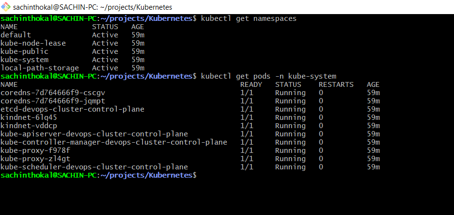

### Task 2: Create and Use Custom Namespaces

```yml
kubectl create namespace dev
kubectl create namespace staging


kubectl run nginx-dev --image=nginx:latest -n dev
kubectl run nginx-staging --image=nginx:latest -n staging

kubectl get pods -A

```

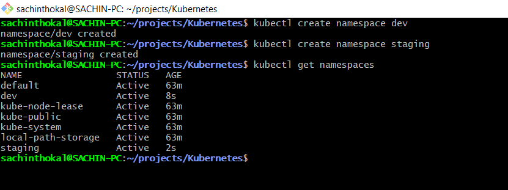

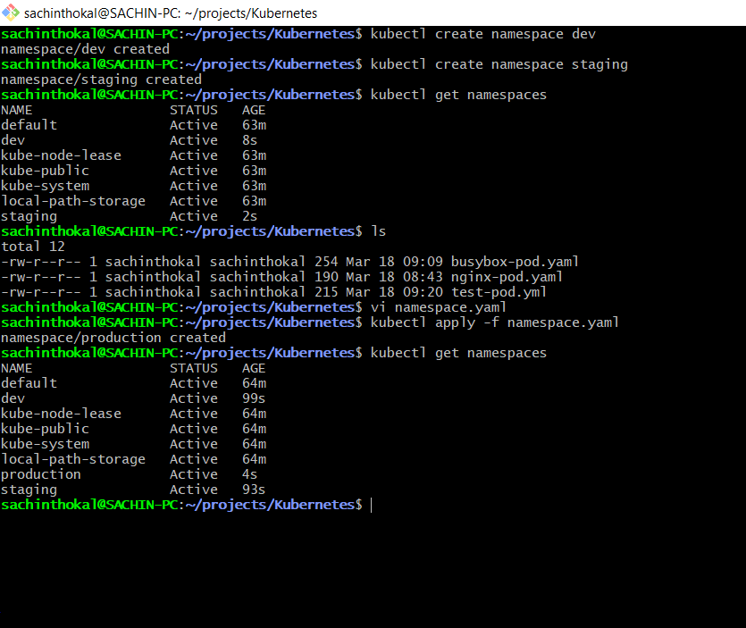

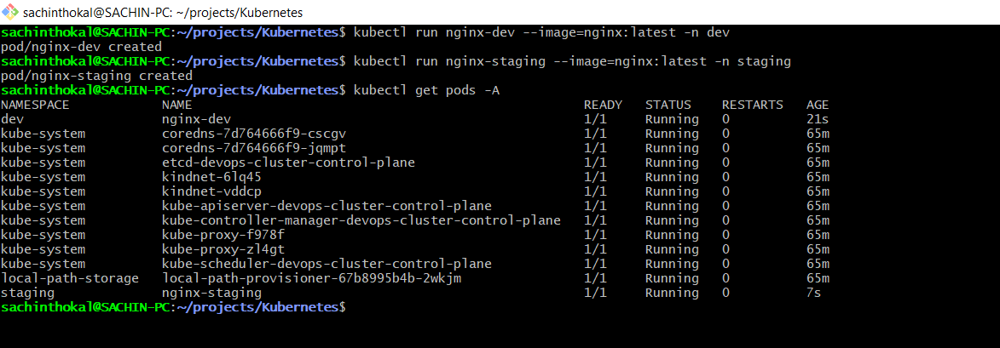

---

### Task 3: Create Your First Deployment

```yml

apiVersion: apps/v1
kind: Deployment
metadata:
  name: nginx-deployment
  namespace: dev
  labels:
    app: nginx
spec:
  replicas: 3
  selector:
    matchLabels:
      app: nginx
  template:
    metadata:
      labels:
        app: nginx
    spec:
      containers:
      - name: nginx
        image: nginx:1.24
        ports:
        - containerPort: 80

```

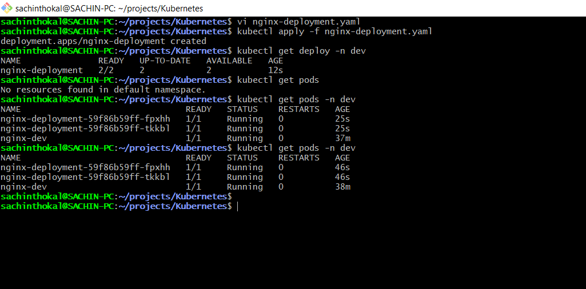

### Task 4: Self-Healing — Delete a Pod and Watch It Come Back

```yml
# List pods
kubectl get pods -n dev

# Delete one of the deployment's pods (use an actual pod name from your output)
kubectl delete pod <pod-name> -n dev

# Immediately check again
kubectl get pods -n dev

```

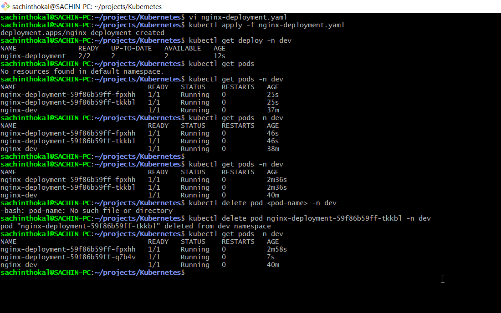

### Task 5: Scale the Deployment

```yml

# Scale up to 5
kubectl scale deployment nginx-deployment --replicas=5 -n dev
kubectl get pods -n dev

# Scale down to 2
kubectl scale deployment nginx-deployment --replicas=2 -n dev
kubectl get pods -n dev

```

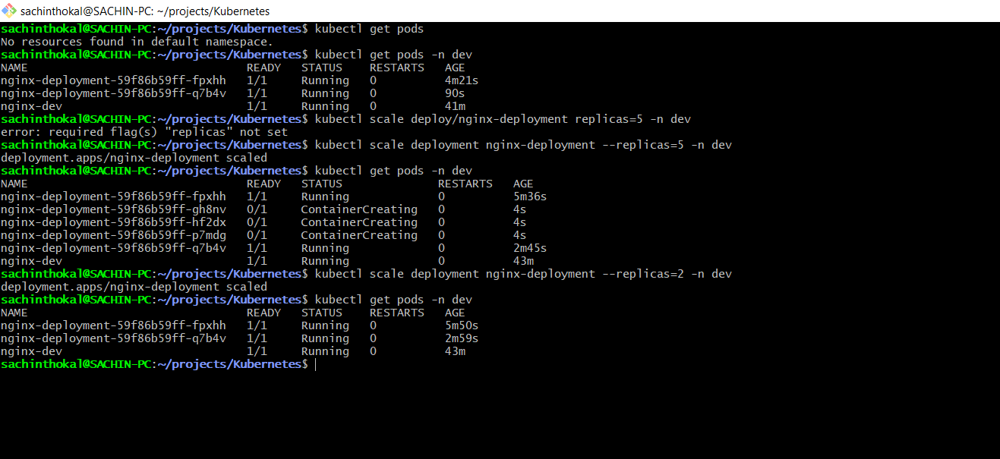

---

### Task 6: Rolling Update

```yml

kubectl set image deployment/nginx-deployment nginx=nginx:1.25 -n dev

kubectl rollout status deployment/nginx-deployment -n dev

kubectl rollout history deployment/nginx-deployment -n dev

kubectl rollout undo deployment/nginx-deployment -n dev
kubectl rollout status deployment/nginx-deployment -n dev

kubectl describe deployment nginx-deployment -n dev | grep Image

```

Before rollout back image nginx:1.25 [ on latest version]

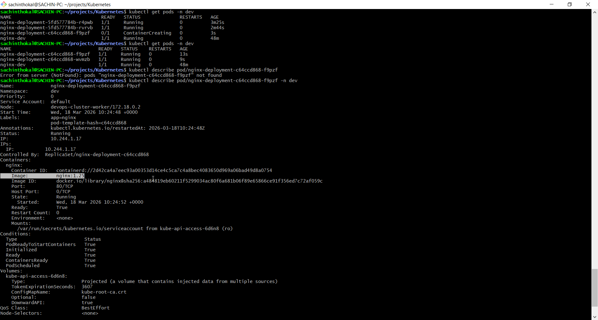

After rollout new image nginx:1.24 [ on old version]

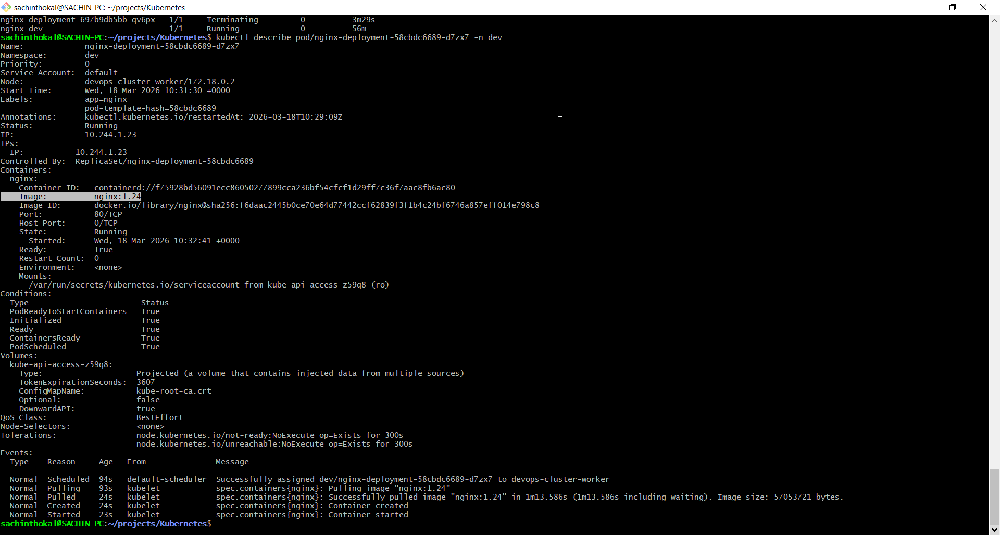

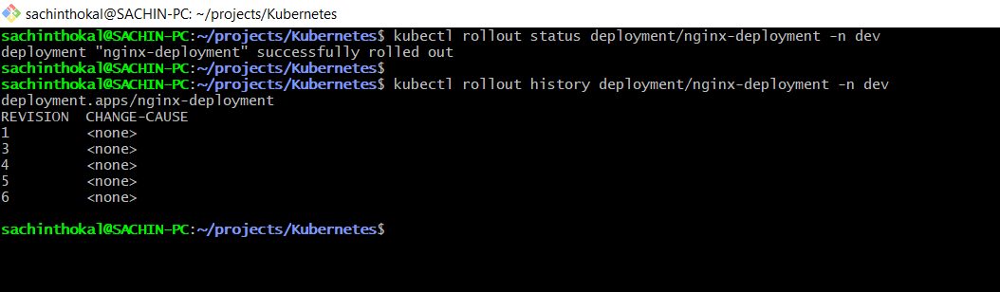

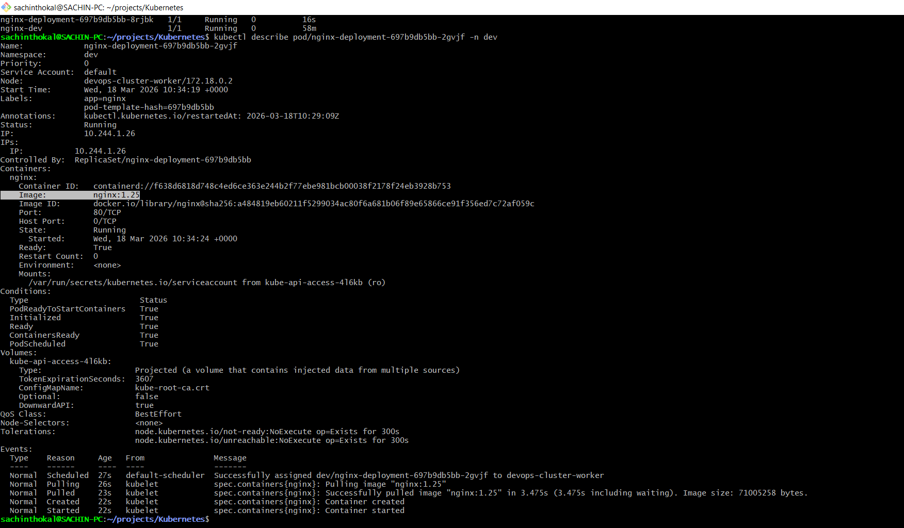

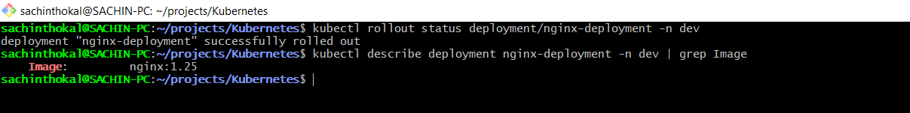

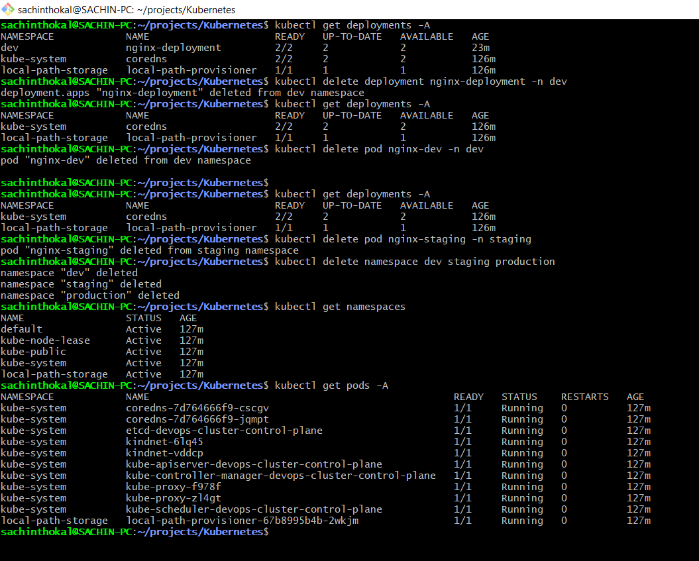

---
