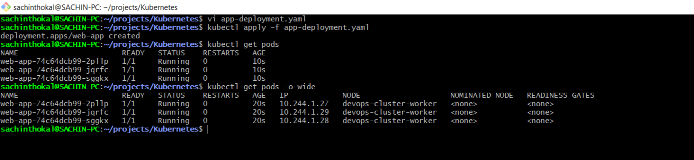
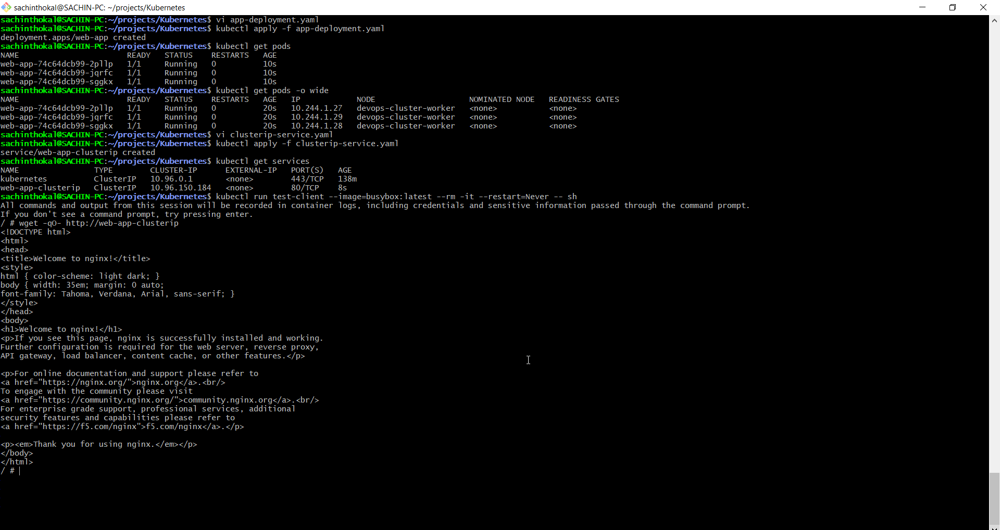
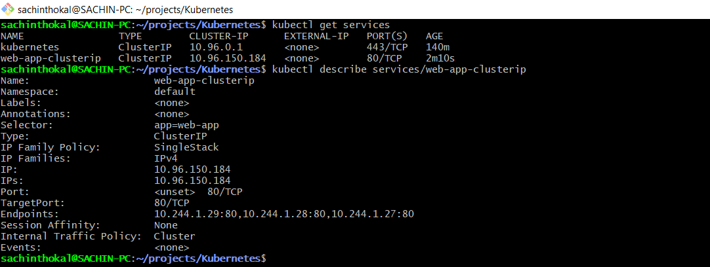
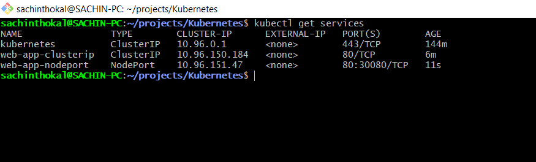
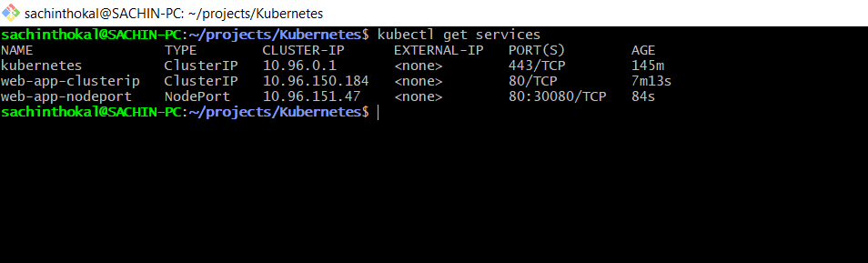
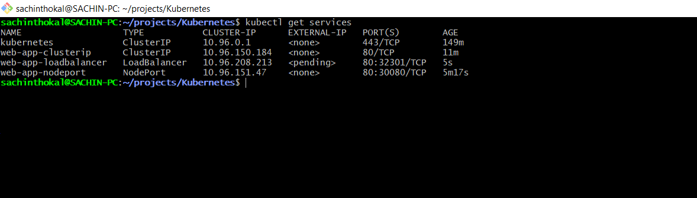

### Task 1: Deploy the Application

```yml
apiVersion: apps/v1
kind: Deployment
metadata:
  name: web-app
  labels:
    app: web-app
spec:
  replicas: 3
  selector:
    matchLabels:
      app: web-app
  template:
    metadata:
      labels:
        app: web-app
    spec:
      containers:
      - name: nginx
        image: nginx:1.25
        ports:
        - containerPort: 80


# kubectl apply -f app-deployment.yaml
# kubectl get pods -o wide

```



---

### Task 2: ClusterIP Service (Internal Access)

```yml
apiVersion: v1
kind: Service
metadata:
  name: web-app-clusterip
spec:
  type: ClusterIP
  selector:
    app: web-app
  ports:
    - port: 80
      targetPort: 80

```



---

### Task 3: Discover Services with DNS



### Task 4: NodePort Service (External Access via Node)





---

```yml

# loadbalancer-service.yaml

apiVersion: v1
kind: Service
metadata:
  name: web-app-loadbalancer
spec:
  type: LoadBalancer
  selector:
    app: web-app
  ports:
  - port: 80
    targetPort: 80

```

### Task 6: Understand the Service Types Side by Side


