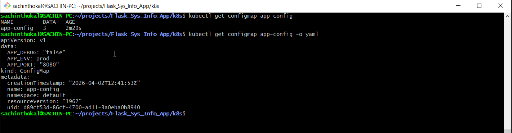
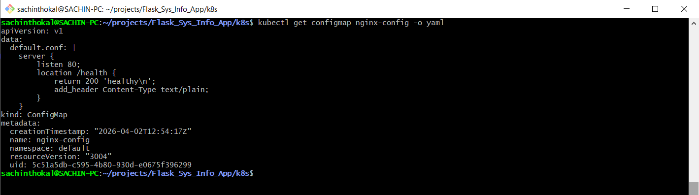
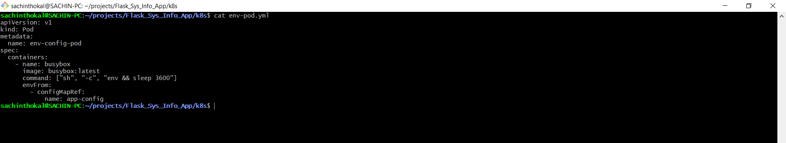
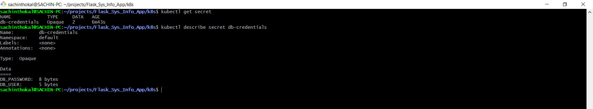

## Task 1: Create a ConfigMap from Literals

```yml
# Create the ConfigMap
kubectl create configmap app-config \
  --from-literal=APP_ENV=production \
  --from-literal=APP_DEBUG=false \
  --from-literal=APP_PORT=8080

# Inspect the data
kubectl get configmap app-config -o yaml

```



## Task 2: ConfigMap from a File

```yml
kubectl create configmap nginx-config --from-file=default.conf=default.conf

```



## Task 3: Use ConfigMaps in a Pod

```yml
apiVersion: v1
kind: Pod
metadata:
  name: env-config-pod
spec:
  containers:
    - name: busybox
      image: busybox:latest
      command: ["sh", "-c", "env && sleep 3600"]
      envFrom:
        - configMapRef:
            name: app-config

```



## Task 4: Create a Secret



## Task 5: Use Secrets in a Pod

```yml
apiVersion: v1
kind: Pod
metadata:
  name: secret-pod
spec:
  containers:
  - name: app-container
    image: alpine
    command: ["sh", "-c", "ls /etc/db-credentials && sleep 3600"]
    env:
    - name: DB_USER
      valueFrom:
        secretKeyRef:
          name: db-credentials
          key: DB_USER
    volumeMounts:
    - name: secret-vol
      mountPath: /etc/db-credentials
      readOnly: true
  volumes:
  - name: secret-vol
    secret:
      secretName: db-credentials
```

## Task 6: Update a ConfigMap and Observe Propagation

```yml
# Create ConfigMap: kubectl create configmap live-config --from-literal=message=hello

apiVersion: v1
kind: Pod
metadata:
  name: reload-pod
spec:
  containers:
  - name: watcher
    image: busybox
    command: ["sh", "-c", "while true; do cat /config/message; sleep 5; done"]
    volumeMounts:
    - name: vol
      mountPath: /config
  volumes:
  - name: vol
    configMap:
      name: live-config

Update ConfigMap: kubectl patch configmap live-config --type merge -p '{"data":{"message":"world"}}'

```

---
## Task 7: Cleanup

```bash
kubectl delete pod env-config-pod nginx-config-pod secret-pod reload-pod
kubectl delete configmap app-config nginx-config live-config
kubectl delete secret db-credentials
```
---