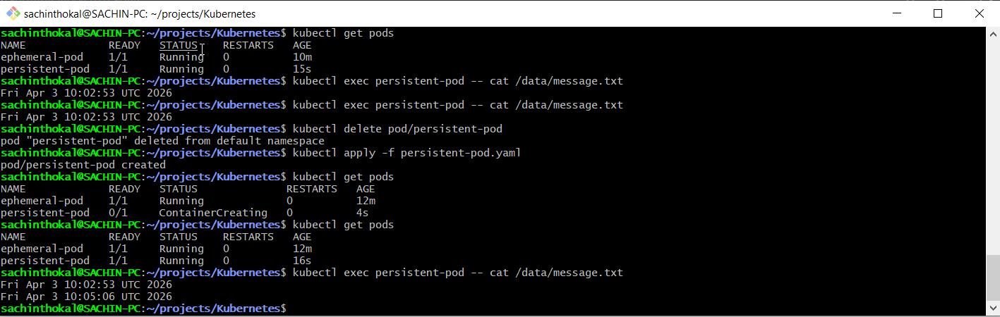
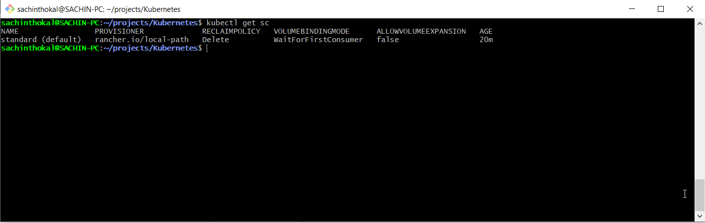

## Task 1: See the Problem — Data Lost on Pod Deletion

```yml
# ephemeral-pod.yaml

apiVersion: v1
kind: Pod
metadata:
  name: ephemeral-pod
spec:
  containers:
  - name: alpine
    image: alpine
    command: ["/bin/sh", "-c", "echo $(date) >> /data/message.txt; sleep 3600"]
    volumeMounts:
    - name: cache-volume
      mountPath: /data
  volumes:
  - name: cache-volume
    emptyDir: {}

```

## Task 2: Create a PersistentVolume (Static Provisioning)

```yml
# pv-static.yaml

apiVersion: v1
kind: PersistentVolume
metadata:
  name: manual-pv
spec:
  capacity:
    storage: 1Gi
  accessModes:
    - ReadWriteOnce
  persistentVolumeReclaimPolicy: Retain
  hostPath:
    path: "/tmp/k8s-pv-data"

```

## Task 3: Create a PersistentVolumeClaim

```yml
# pvc-static.yaml
apiVersion: v1
kind: PersistentVolumeClaim
metadata:
  name: manual-pvc
spec:
  accessModes:
    - ReadWriteOnce
  resources:
    requests:
      storage: 500Mi

```

## Task 4: Use the PVC in a Pod

```yml
# persistent-pod.yaml

apiVersion: v1
kind: Pod
metadata:
  name: persistent-pod
spec:
  containers:
  - name: alpine
    image: alpine
    command: ["/bin/sh", "-c", "echo $(date) >> /data/message.txt; sleep 3600"]
    volumeMounts:
    - name: storage
      mountPath: /data
  volumes:
  - name: storage
    persistentVolumeClaim:
      claimName: manual-pvc
```



---

## Task 5: StorageClasses and Dynamic Provisioning



## Task 6: Dynamic Provisioning

```yml
# pvc-dynamic.yaml

apiVersion: v1
kind: PersistentVolumeClaim
metadata:
  name: dynamic-pvc
spec:
  accessModes:
    - ReadWriteOnce
  storageClassName: standard # Use your cluster's default SC name
  resources:
    requests:
      storage: 200Mi
```

---
