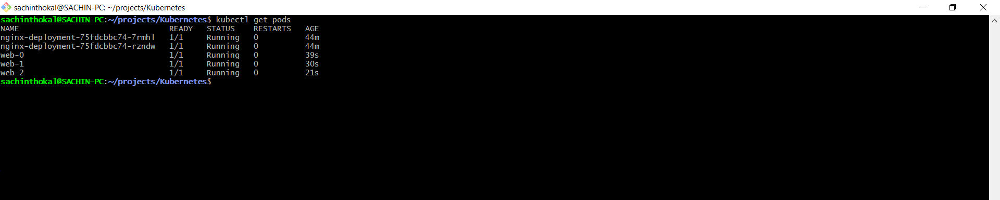
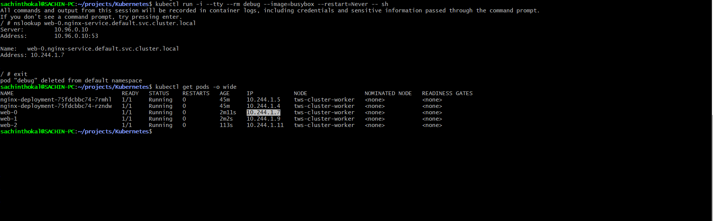
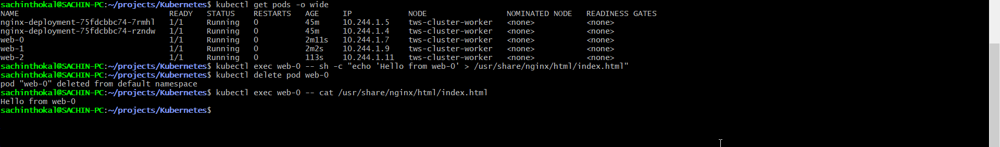
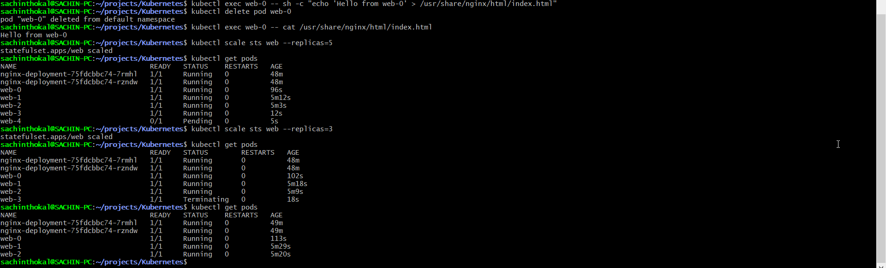

## Task 1: Understand the Problem

```
When using a Deployment, pod names are generated using a template hash (e.g., web-7689d85fd8-5p9rq). If a pod dies, its replacement gets a completely new random string.

Why is this a problem for databases?
Databases often operate in clusters (like MySQL MGR or PostgreSQL Primary/Replica). They need to know exactly who their peers are. If "Pod-A" dies and comes back as "Pod-XYZ," the rest of the cluster won't recognize it, breaking the replication configuration.
```

## Task 2: Create a Headless Service

```yml
# service.yaml

apiVersion: v1
kind: Service
metadata:
  name: nginx-service
spec:
  ports:
  - port: 80
    name: web
  clusterIP: None # This makes it headless
  selector:
    app: nginx

```

## Task 3: Create a StatefulSet

```yml
# statefulset.yaml

apiVersion: apps/v1
kind: StatefulSet
metadata:
  name: web
spec:
  serviceName: "nginx-service"
  replicas: 3
  selector:
    matchLabels:
      app: nginx
  template:
    metadata:
      labels:
        app: nginx
    spec:
      containers:
      - name: nginx
        image: nginx
        ports:
        - containerPort: 80
          name: web
        volumeMounts:
        - name: www
          mountPath: /usr/share/nginx/html
  volumeClaimTemplates:
  - metadata:
      name: www
    spec:
      accessModes: [ "ReadWriteOnce" ]
      resources:
        requests:
          storage: 100Mi

```



## Task 4: Stable Network Identity

```yml
# kubectl run -i --tty --rm debug --image=busybox --restart=Never -- sh

# kubectl get pods -o wide
```



## Task 5: Stable Storage Verification

```yml
# kubectl exec web-0 -- sh -c "echo 'Hello from web-0' > /usr/share/nginx/html/index.html"

# kubectl delete pod web-0


# kubectl exec web-0 -- cat /usr/share/nginx/html/index.html
```



## Task 6: Ordered Scaling

```yml
# Scale Up: kubectl scale sts web --replicas=5
# Scale Down: kubectl scale sts web --replicas=3

# kubectl get pvc

```



## Task 7: Clean Up

```yml
# kubectl delete sts web
# kubectl delete svc nginx-service

# kubectl get pvc
# kubectl delete pvc -l app=nginx

```

---
