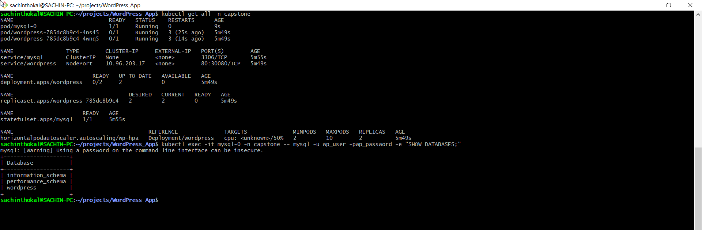
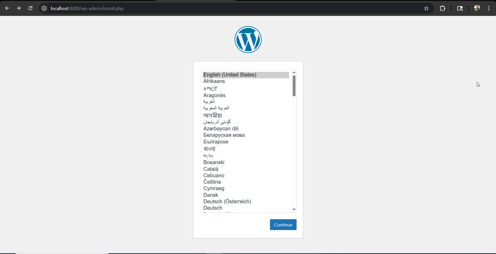

## Day 60 – Capstone: Deploy WordPress + MySQL on Kubernetes


```yml
# k8s-secrets.yaml
apiVersion: v1
kind: Namespace
metadata:
  name: capstone
---
apiVersion: v1
kind: Secret
metadata:
  name: mysql-secrets
  namespace: capstone
type: Opaque
stringData:
  MYSQL_ROOT_PASSWORD: adminpassword
  MYSQL_DATABASE: wordpress
  MYSQL_USER: wp_user
  MYSQL_PASSWORD: wp_password

# mysql-db.yaml

apiVersion: v1
kind: Service
metadata:
  name: mysql
  namespace: capstone
spec:
  ports:
  - port: 3306
  clusterIP: None
  selector:
    app: mysql
---
apiVersion: apps/v1
kind: StatefulSet
metadata:
  name: mysql
  namespace: capstone
spec:
  serviceName: "mysql"
  replicas: 1
  selector:
    matchLabels:
      app: mysql
  template:
    metadata:
      labels:
        app: mysql
    spec:
      containers:
      - name: mysql
        image: mysql:8.0
        envFrom:
        - secretRef:
            name: mysql-secrets
        resources:
          requests:
            cpu: 250m
            memory: 512Mi
          limits:
            cpu: 500m
            memory: 1Gi
        ports:
        - containerPort: 3306
        volumeMounts:
        - name: mysql-data
          mountPath: /var/lib/mysql
  volumeClaimTemplates:
  - metadata:
      name: mysql-data
    spec:
      accessModes: [ "ReadWriteOnce" ]
      resources:
        requests:
          storage: 1Gi


# wordpress-app.yaml

apiVersion: v1
kind: ConfigMap
metadata:
  name: wp-config
  namespace: capstone
data:
  WORDPRESS_DB_HOST: mysql-0.mysql.capstone.svc.cluster.local:3306
  WORDPRESS_DB_NAME: wordpress
---
apiVersion: apps/v1
kind: Deployment
metadata:
  name: wordpress
  namespace: capstone
spec:
  replicas: 2
  selector:
    matchLabels:
      app: wordpress
  template:
    metadata:
      labels:
        app: wordpress
    spec:
      containers:
      - name: wordpress
        image: wordpress:latest
        envFrom:
        - configMapRef:
            name: wp-config
        env:
        - name: WORDPRESS_DB_USER
          valueFrom:
            secretKeyRef:
              name: mysql-secrets
              key: MYSQL_USER
        - name: WORDPRESS_DB_PASSWORD
          valueFrom:
            secretKeyRef:
              name: mysql-secrets
              key: MYSQL_PASSWORD
        resources:
          requests:
            cpu: 200m
            memory: 256Mi
        ports:
        - containerPort: 80
        livenessProbe:
          httpGet:
            path: /wp-login.php
            port: 80
          initialDelaySeconds: 30
        readinessProbe:
          httpGet:
            path: /wp-login.php
            port: 80
          initialDelaySeconds: 10
---
apiVersion: v1
kind: Service
metadata:
  name: wordpress
  namespace: capstone
spec:
  type: NodePort
  ports:
  - port: 80
    targetPort: 80
    nodePort: 30080
  selector:
    app: wordpress
---
apiVersion: autoscaling/v2
kind: HorizontalPodAutoscaler
metadata:
  name: wp-hpa
  namespace: capstone
spec:
  scaleTargetRef:
    apiVersion: apps/v1
    kind: Deployment
    name: wordpress
  minReplicas: 2
  maxReplicas: 10
  metrics:
  - type: Resource
    resource:
      name: cpu
      target:
        type: Utilization
        averageUtilization: 50
```

## Verifiy Cmds

```bash
# Check all resources
kubectl get all -n capstone

# Verify DB connectivity
kubectl exec -it mysql-0 -n capstone -- mysql -u wp_user -pwp_password -e "SHOW DATABASES;"

# Get WordPress URL (Kind)
kubectl port-forward svc/wordpress 8080:80
```


