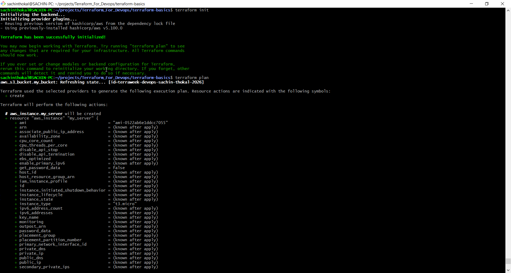
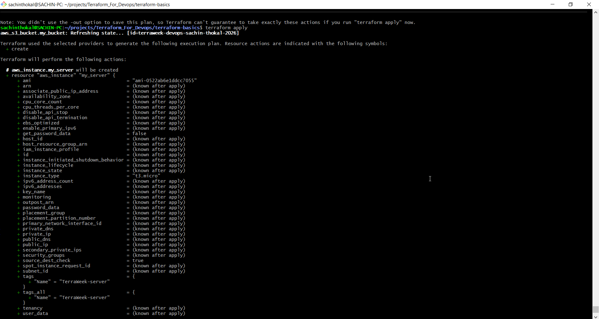
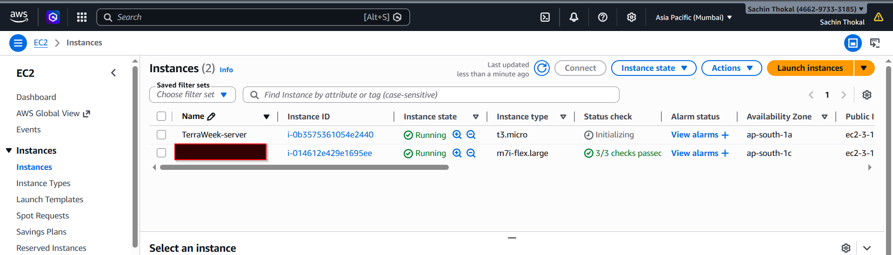
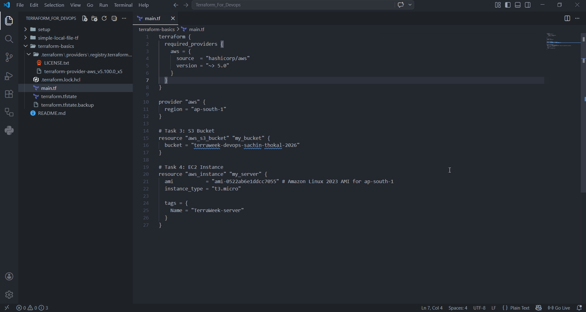
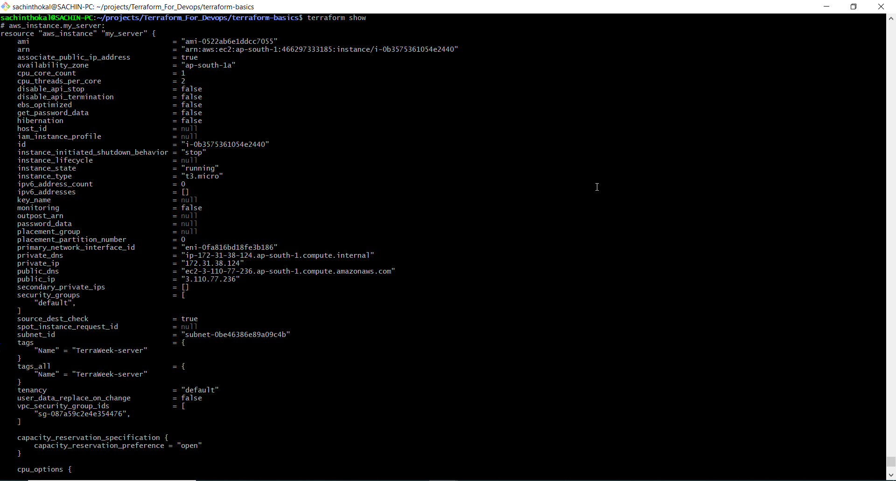
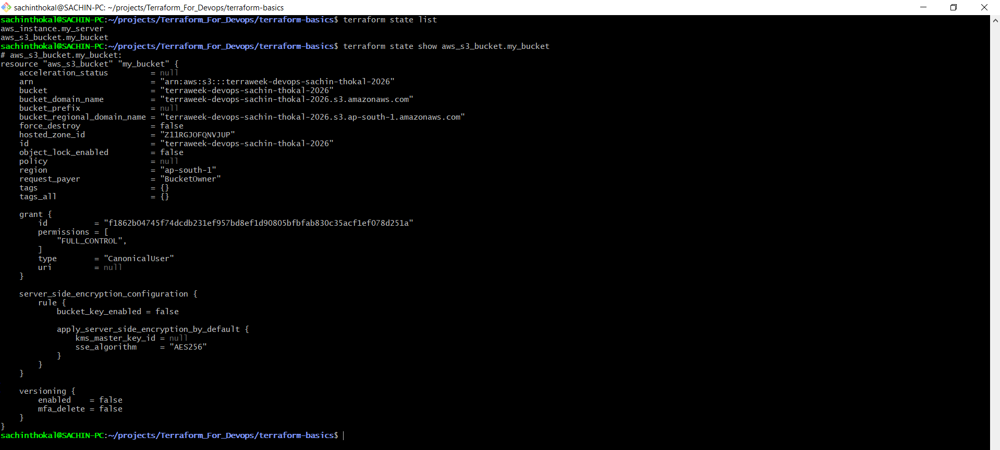
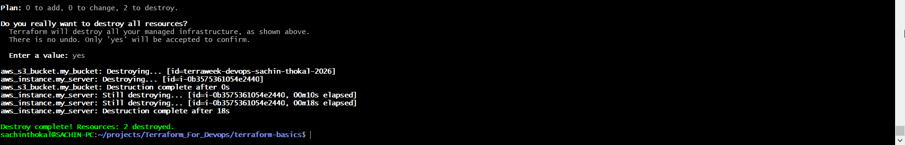
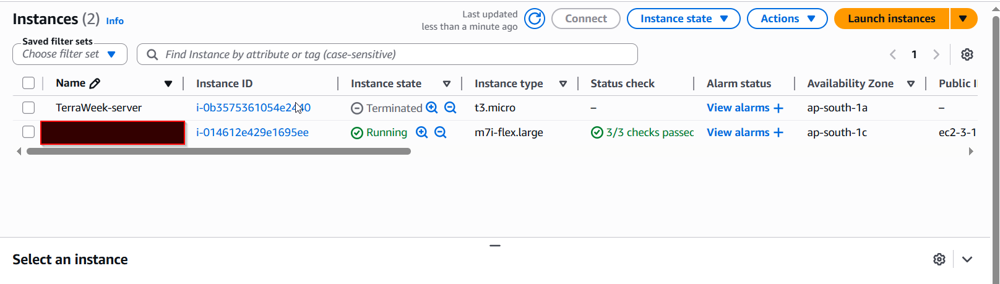

# Task 1: Understand Infrastructure as Code

#### What is Infrastructure as Code (IaC)? Why does it matter in DevOps?

```bash
In the old days, if you needed a server, you’d log into a dashboard, click ten buttons, and hope you didn't forget step seven. IaC changes that. It means you write a text file (code) that says, "I want three servers and a database," and a tool automatically builds it for you.

# Why it matters in DevOps:

DevOps is all about speed and reliability. 
If you can "code" your infrastructure, you can test it, share it with your team, and rebuild it in seconds if something breaks. 
It turns "IT setup" into a fast, repeatable process.
```

---

#### What problems does IaC solve compared to manually creating resources in the AWS console?

```bash
Manually clicking through the AWS Console is fine for a weekend project, but for a real job, it’s a nightmare because:

Human Error: You will eventually forget to check a box or click the wrong dropdown.

The "Black Box" Problem: If your lead engineer leaves, and they’re the only one who knows how the network was set up, you're stuck.

Scaling: If you need to replicate your setup in 5 different regions (London, Tokyo, NYC, etc.), doing it manually takes all day. With IaC, it takes one command.
```

---

#### How is Terraform different from AWS CloudFormation, Ansible, and Pulumi?

Here is how the "Big Four" stack up:

| Tool | Vibe | Key Difference |
|:-----------|:------------:|------------:|
| Terraform | The All-Rounder | Works on AWS, Azure, Google Cloud—everything. |
| CloudFormation |  The AWS Specialist | Built by AWS, for AWS. Excellent, but you're locked into their ecosystem. |
| Ansible | The Decorator | Mostly used to configure software inside a server after it's already built. |
| Pulumi | The Developer's Choice | Instead of a special language, you use real code like Python or TypeScript. |

---

#### What does it mean that Terraform is "declarative" and "cloud-agnostic"?

```bash
Declarative (The "What," not the "How")
Imagine you’re at a restaurant.

Imperative (Manual/Scripting): You go into the kitchen and tell the chef: "Turn on the stove, crack two eggs, fry them for 3 minutes."

Declarative (Terraform): You sit at the table and say: "I want two fried eggs."
Terraform figures out the steps to make it happen. If you already have one egg, it just cooks one more.

Cloud-Agnostic (The "Traveler")
Most tools are loyal to one brand (like CloudFormation is to AWS). Cloud-Agnostic means Terraform doesn't care who you use. You can use the same tool and the same logic to manage AWS, Azure, or even a local database. It’s like having a universal remote for every TV in the world
```

---

# Task 2: Install Terraform and Configure AWS

```bash
# macOS
brew tap hashicorp/tap
brew install hashicorp/tap/terraform

# Linux (amd64)
wget -O - https://apt.releases.hashicorp.com/gpg | sudo gpg --dearmor -o /usr/share/keyrings/hashicorp-archive-keyring.gpg
echo "deb [signed-by=/usr/share/keyrings/hashicorp-archive-keyring.gpg] https://apt.releases.hashicorp.com $(lsb_release -cs) main" | sudo tee /etc/apt/sources.list.d/hashicorp.list
sudo apt update && sudo apt install terraform

# Windows
choco install terraform
```

Install Terraform: URL
---

Verify:

```bash
terraform -version
```

Install and configure the AWS CLI:

```bash
aws configure
# Enter your Access Key ID, Secret Access Key, default region (e.g., ap-south-1), output format (json)
```

Verify AWS access:

```
aws sts get-caller-identity
```

---

#### Task 3: Your First Terraform Config -- Create an S3 Bucket

#### Task 4: Add an EC2 Instance

```bash
# mkdir terraform-basics && cd terraform-basics

terraform {
  required_providers {
    aws = {
      source  = "hashicorp/aws"
      version = "~> 5.0"
    }
  }
}

provider "aws" {
  region = "ap-south-1" 
}

# Task 3: S3 Bucket
resource "aws_s3_bucket" "my_bucket" {
  bucket = "terraweek-devops-sachin-thokal-2026"
}

# Task 4: EC2 Instance
resource "aws_instance" "my_server" {
  ami           = "ami-0522ab6e1ddcc7055" # Amazon Linux 2023 AMI for ap-south-1
  instance_type = "t3.micro"

  tags = {
    Name = "TerraWeek-server"
  }
}

```







---

#### Task 5: Understand the State File

```bash
terraform show                          # Human-readable view of current state
terraform state list                    # List all resources Terraform manages
terraform state show aws_s3_bucket.<name>   # Detailed view of a specific resource
terraform state show aws_instance.<name>
```



---

### Answer these questions in your notes

What information does the state file store about each resource?

```bash
The state file acts as a 1:1 map between your configuration and the real world. It stores:

Unique Identifiers: The specific AWS IDs (like i-0a1b2c3d... for EC2 or the exact ARN for S3).

Attributes & Metadata: Every single detail returned by the AWS API—even things you didn't define in your code, like the public/private IP addresses, the creation timestamp, and the volume ID of the root disk.

Dependencies: It tracks which resources depend on others (e.g., "The EC2 instance needs this Security Group to exist first").

Sensitive Data: If a resource creates a password or a private key, it is stored here in plain text.
```

Why should you never manually edit the state file?

```bash
Corruption Risk: Terraform expects the JSON to be perfectly formatted. A single missing comma or bracket will cause Terraform to "lose its memory," making it unable to manage your infrastructure.

Consistency Gap: If you delete a resource ID from the state file, Terraform will think that resource doesn't exist and try to create a new one, leading to "Ghost Resources" in AWS that you are still paying for.

The "State" Command exists: If you need to fix something, Terraform provides the terraform state command (like mv, rm, list) which handles the JSON logic for you safely.

```

Why should the state file not be committed to Git?

```bash
Security (Sensitive Info): As mentioned, passwords, keys, and environment variables are stored in plain text in the state file. Putting this in Git is a massive security leak.

Concurrency Issues (State Locking): If you and a teammate both commit changes to the state file, you will get merge conflicts. In infrastructure, a "merge conflict" can result in half-built servers or accidental deletions.

The "Source of Truth" Problem: Infrastructure state changes constantly. Git is for versioning intent (the code), while the state file represents the current reality. For teams, we use "Remote Backends" (like S3 with DynamoDB locking) instead of Git.
```
#### Task 6: Modify, Plan, and Destroy

Finally, destroy everything:
```bash
terraform destroy
```
Verify in the AWS console -- both the S3 bucket and EC2 instance should be gone

---



